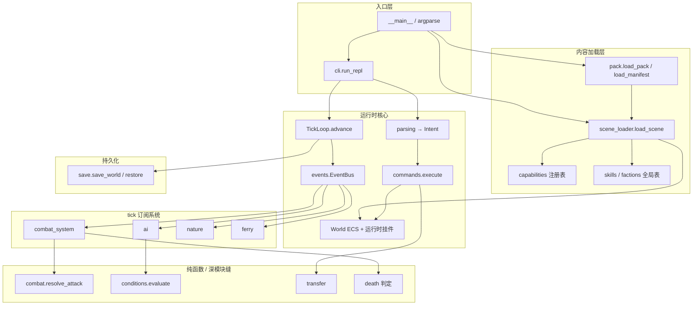

# 截至 M3 的 engine 架构独立评审（原始产出）

## 元信息

| 字段 | 值 |
|---|---|
| 角色 | 游戏高级架构师（独立评审，未与其他专家协商） |
| 日期 | 2026-07-21 |
| 范围 | 截至 M3（M0–M3 完成；用户决定先停在 M3，不推后续商业化与创作者平台） |
| 工作区 | `/home/gukt/github/xkx2001-utf8` |
| 约束 | 只读调研；不改 `engine/` 代码；不写 `final/` / `adversarial/` |

---

## Executive summary

截至 M3，绿场 `mud_engine`（约 9.4k 行、31 个顶层模块、649 测试绿）已经跑通一条自洽的单机 CLI 闭环：YAML/内容包 → ECS World → 解析/意图 → 命令执行 → tick/`on_tick` 世界演化 → JSON 原子存档。这比「能跑」更进一步：多处真正是深模块（`resolve_attack`、条件求值器、`EventBus`+`run_vetoable`、`transfer`、`load_pack` 组合外壳），且与 ADR-0004「骨架固定 + 钩子策略注入」在战斗结算、门槏、Nature、渡口、技能钩子上反复复用同一接缝手法。

主要优点是**运行时两条路径边界清晰**（命令只改「一次性意图」，tick 驱动战斗/AI/Nature/渡口）以及 **M3 刻意不做表达力扩张**（`pack` 组合 `load_scene`、零改已知字段集），用非武侠示例包证明了题材无关加载边界。不变量符合度整体高：单机纯 Python、内存+JSON、绿场、不做 LPC 等价、不做引擎内编辑器——均落地。

最大架构风险不是「缺商业化」，而是 **ADR-0004 承诺的 Effect 生命周期机制几乎空白**（状态子系统被 M2-16 用文案+一次性伤害顶替），与 mvp-scope「状态 = MVP 必做」及 ADR 正文存在实质性落差；同时 **`commands.py` / `capabilities.py` 已成上帝模块**，`World` 正从 ECS 容器滑向服务定位器，全局注册表（`SKILLS`/`FACTIONS`/`commands._REGISTRY`）与世界级 `EventBus` 作用域不一致。模块图是扁平包、靠 TYPE_CHECKING 与局部 import 压循环依赖（`ai↔commands`、`combat↔skills`、`death_flow↔combat_system`），短期可维护，中期会拖慢任何「再加一条领域路径」的改动。

若停在 M3：优先偿还 Effect 缺口决策（实现或正式改判 ADR）、拆分命令/能力注册表上帝模块、统一「全局 vs 世界」注册表策略、消灭战斗回合模块级可变缓冲。不建议在停机窗口做分层大搬家或提前上多进程世界隔离。

---

## 架构现状测绘

### 包与规模

- 唯一活包：`engine/src/mud_engine/`（扁平，无 `core/`/`domain/`/`runtime/` 子包）
- 约 **9416** 行生产代码；体量尖峰：`commands.py`（1565）、`capabilities.py`（1298）、`scene_loader.py`（769）、`parsing.py`（544）、`components.py`（528）
- 测试：`engine/tests/` 约 53 文件 / ~9.7k 行；PROGRESS 称 649 绿
- 内容：`engine/data/m1_default_scene.yaml`、`m2_mvp_scene.yaml`；M3 示例包在 `.scratch/m3-ugc-loop-creation-surface/example-pack/`

### 逻辑分层（事实分层，非目录分层）

### 关键模块职责

| 模块 | 职责摘要 | 深/浅判断 |
|---|---|---|
| `world.py` | Entity/Component 存储 + 大量运行时挂件字段 | 存储深；挂件面变浅（服务定位器趋势） |
| `components.py` | 全部组件数据类 + `transient_field` | 数据字典，合理但持续膨胀 |
| `events.py` | `EventBus`、`Deny`/`run_vetoable`、`TickContext` | **深**：小接口、多消费者 |
| `tick.py` | tick 计数 + `on_tick` + 周期/`force_save` | **深** |
| `commands.py` | 注册表 + 生命周期钩子 + **全部**命令实现 | **浅/上帝模块** |
| `parsing.py` / `intent.py` / `matching.py` | 文本→意图 | 边界清楚，偏深 |
| `combat.py` | 七步 `resolve_attack` + `PowerModel` | **深**（纯函数 seam） |
| `combat_system.py` | Engaged + tick 交战 + 战斗事件点 | 中等深；与 death 互依 |
| `skills.py` | `SKILLS` 全局表 + `SkillBehavior` | 中等；与 combat 互相 import |
| `conditions.py` | 受限条件 AST + `ConditionContext` | **深** |
| `capabilities.py` | 物品/房间/NPC 能力自描述 + codec | 概念深、文件过胖 |
| `scene_loader.py` | YAML→World 编排 + attach_* | 编排层，耦合面大 |
| `pack.py` | manifest + `load_pack` 组合 | **深**（M3 做得对） |
| `save.py` | 按实体 JSON + symlink 原子发布 | **深**（崩溃恢复语义清楚） |
| `ai`/`ferry`/`nature`/`entity_gate`/`death_flow` | 各领域 tick/事件订阅 | 模式同构，质量不均 |
| `transfer.py` | 物品转移 + 领域 veto | **深** |

### 运行时循环（命令 / 事件 / 战斗 / 世界 / 存档）

1. **启动**：`--pack` → `load_pack`（manifest→`load_scene`）或默认 `build_world`/`restore`；restore 后幂等 `attach_*` + `reattach_pack_manifest`。
2. **每条玩家输入**（`cli`）：`parse` → `commands.execute`（`on_command_before` → handler → 领域事件点 → `on_command_after`）→ `TickLoop.advance`。
3. **`advance`**：`tick++` → `dispatch(ON_TICK)`（Nature / AI / Ferry / Combat 等）→ 每 N tick `save_fn`；`quit` 走 `force_save`（不分发 `on_tick`）。
4. **战斗**：`attack` 只建 `Engaged`；伤害在 combat 的 `on_tick` 里 `resolve_attack` 再 apply；气血归零进 `death_flow`。
5. **效果（现状）**：无独立 Effect 调度/衰减/移除管线；`SkillBehavior` 可改伤害/加播报；模块级 `_ROUND_EXTRA_FRAGMENTS` 承载回合文案碎片。
6. **存档权威**：内存态权威；存档只序列化 entities/components（及 `scene_path` meta）；`events`/nature/ai/combat/ferries/spawners/`pack_manifest`/`extension_data` 等运行时态不进档，靠重挂。

该循环在单机单玩家 CLI 下**自洽**；命令路径与 tick 路径职责划分与 M1 spec 用户故事 17/18 一致，是当前架构最重要的健康信号之一。

### 依赖方向（实测）

- **扇入最高**：`world`（几乎被全体依赖）、`components`、`events`
- **相互依赖（AST 级）**：`ai↔commands`（Chatter 借 `room_say`）、`combat↔skills`、`combat_system↔death_flow`，以及多个 `X↔world`（多为 TYPE_CHECKING / 延迟 import）
- **全局 vs 实例**：`commands._REGISTRY`、`SKILLS`、`FACTIONS`、`CAPABILITIES*` 为**进程全局**；`world.events` 与多数 `attach_*` 态为**世界实例**——注释已意识到多世界隔离需求，但命令/技能表尚未跟进

---

## 优点与不变量符合度

### 做得好的地方

1. **深模块 seam 真实存在且被测试锁住**：`resolve_attack`、`evaluate`、`transfer`、`TickLoop`、存档原子发布、pack 校验——符合 codebase-design「小接口、大实现隐藏」取向。
2. **接缝手法一致**：声明式数据（YAML/`SkillData`/`DeathPolicy`）+ Protocol（`PowerModel`/`SkillBehavior`/`ConditionContext`）+ 注册表/`attach_*`/`on_*` 事件点；M1 非战斗推广到 M2 战斗再被 M3 外壳复用，闭环成立。
3. **M3 范围纪律极好**：组合而非改造 `load_scene`；`--validate` 复用同一校验路径；非武侠示例包验证题材无关——对齐 ADR-0005/0006 与「停在 M3」决策。
4. **运行时态 / 存档态分离有意识**：`transient_field`、挂件不进档、restore 重挂——避免把订阅表序列化进 JSON。
5. **出口可动态改写**：渡口成为 M1「运行时增删 Exit」的第一个真实用例，验证了预留机制不是空钩子。

### 与架构不变量 / ADR 对照

| 不变量 / ADR | 符合度 | 说明 |
|---|---|---|
| 单机、纯 Python、内存+本地 JSON | 高 | CLI 单进程；无 PG/Redis/分布式 |
| 不做 LPC 行为等价（0001） | 高 | `DefaultWuxiaPowerModel` 自洽可测，不追 LPC |
| 绿场 `engine/`（0002）+ 包名 `mud_engine`（0003） | 高 | 扁平包，无旧 `xkx` import |
| 战斗骨架+钩子归引擎（0004） | **中** | 七步+PowerModel+SkillBehavior 有；**Effect 生命周期机制基本未落地** |
| M3 包外声明式创作面（0005） | 高 | manifest+scene+`--pack`/`--validate` |
| 引擎不做编辑器/留言板（0006） | 高 | 无相关代码路径 |
| MVP 场景清单（华山/扬州/少林/野外/官道/渡口/坐骑） | 高（内容层） | M2 场景 YAML + e2e；属题材包而非引擎结构问题 |
| 商业化四支撑点「只留位置」 | 中（有意欠） | `PackManifest.creator/version/extra` 是元数据雏形；账本/埋点/进程隔离未留接口骨架——用户已决定停 M3，可接受，但勿假装「位置已留齐」 |
| mvp-scope MVP 必做中的频道/登录/表情等 | 低（阶段性未做） | 当前产品形态是单机 CLI；与「多人 MUD 必做清单」有意识错位，停机前应记为已知缺口而非静默当已交付 |

---

## 风险与问题清单

**R1. ADR-0004 Effect 生命周期缺口（架构承诺 vs 实现）**  
证据：`docs/adr/0004-combat-effects-boundary-engine.md` 明确「Effect 调度/衰减/移除机制」归引擎；全库 `Effect`/`StackingPolicy`/`EffectMode`/`register_condition` **无实现**（仅 `events.py`/`tick.py` 注释预留）；M2-16 票文明确允许「文案+一次性伤害」代替完整 buff。  
影响：状态子系统在归类上是 MVP 必做，但引擎没有可挂「中毒每 tick 掉血 / 叠层 / 到时移除」的统一机制；题材包只能把效果硬编码进 `SkillBehavior`，接缝会再次分叉。  
停 M3 语境：这是**必须显式决策**的债务（实现最小 Effect 或改判 ADR/归类），不能靠「以后再说」悬空。

**R2. `commands.py` 上帝模块（1565 行 / ~25 动词）**  
证据：移动、门、物品、商店、门派、坐骑、战斗交战、成长查询全部挤在同一文件；领域逻辑与注册表共存。  
影响：任何新命令/昏迷限制/权限阶段都会继续胀文件；AI 与人改动冲突面最大；深模块被浅入口淹没。

**R3. `capabilities.py` 过胖（1298 行）+ 加载/存档知识集中**  
证据：物品/房间/NPC 三类 `CapabilitySpec`、YAML/`to_dict`/`from_dict` 全堆一处；`scene_loader`/`save` 强依赖。  
影响：「加一个能力」理论上只改注册表，实际上仍是超大文件内手术；codec 与领域规则边界模糊。

**R4. `World` 服务定位器化**  
证据：`world.py` 除 ECS 外挂 `events`、`nature`、`ai`、`combat`、`ferries`、`spawners`、`item_templates`、`room_ids`、`death_policy`、`pack_manifest`、`power_model`、`pending_messages`、`extension_data` 等。  
影响：新系统默认「再加一个 world.xxx」；测试可构造性尚可，但依赖方向从「组件查询」滑向「问 World 要子系统」。与「世界实例隔离」长期目标冲突面在变大。

**R5. 全局注册表与世界实例作用域不一致**  
证据：`skills.SKILLS`、`factions.FACTIONS`、`commands._REGISTRY`、`CAPABILITIES*` 为模块全局；`EventBus` 挂 World。`load_scene` 靠 `replace_*_registry` 清空重建防污染。  
影响：同进程测两个包/两个 World 时命令表共享可接受，但技能/门派表会互相覆盖；未来「一进程多包」或并行测试会踩隐性竞态。注释已指向多世界，实现未对齐。

**R6. 循环依赖靠延迟 import 维持**  
证据：`ai` 内 `from mud_engine.commands import room_say`；`combat↔skills`；`death_flow↔combat_system`。  
影响：包初始化顺序脆弱；拆分/提纯公共原语（如 `room_broadcast`）成本会上升；静态分析/分层工具难落地。

**R7. 战斗回合模块级可变状态**  
证据：`combat.py` 的 `_ROUND_EXTRA_FRAGMENTS` + `append_round_fragment`（进程级 list）。  
影响：并发或同进程多 World 交战时串扰；即便单机单玩家也破坏「`resolve_attack` 纯函数」叙事的纯度（副作用藏在模块全局）。

**R8. 默认武侠语义渗入引擎内核**  
证据：`DefaultWuxiaPowerModel`、组件字段名 `qi`/`neili`/`jingli`、默认招式名「拳头」、少林向示范行为在 `skills.py`。  
影响：与「题材无关引擎」宣言张力可控（默认策略+官方包），但 UGC 非武侠包若误用默认模型会「看起来像武侠公式」；缺乏「无默认题材公式则拒绝开战」的显式策略开关。

**R9. 条件语言查询面膨胀风险**  
证据：`ConditionContext` 已从 Nature 扩展到 `faction_id`/`gender`/`is_wielding_edged_weapon`（门槏）。  
影响：继续往协议加属性会把「世界环境 DSL」变成「任意实体查询上帝接口」；需要冻结扩展策略（新 Context 类型 vs 协议加字段）。

**R10. mvp-scope「MVP 必做」多人能力未交付（产品错位，非实现 bug）**  
证据：08 号票频道/登录/表情等仍为 MVP 必做；引擎仅为单玩家 CLI。  
影响：若有人按归类表验收「MVP 引擎完整度」会误判；停 M3 时应在进度叙事上标明「当前交付 = 单机可玩内核 + UGC 加载契约」，而非「18 个 MVP 必做子系统全部引擎化」。

**R11. `scene_loader` 编排职责过重**  
证据：769 行内建房/物/NPC/出口、校验商店与门派引用、挂 nature/ai/ferry/combat/entry_guard、写 `room_ids`/`death_policy`。  
影响：内容加载 = 隐式「游戏组装根」；缺少显式 `GameBootstrap`/`RuntimeWiring` 边界，restore 路径在 `__main__` 重复列举 attach 列表（易漏挂）。

**R12. 扩展数据透传未消费**  
证据：`world.extension_data` / entity 级透传（M1-11）注释写明供 M3 规则引擎；M3 明确不扩表达力、不解析执行。  
影响：不是缺陷，但是**悬空扩展点**——停机后读者可能以为有规则引擎；应视为「数据保留、语义未定义」。

---

## 与侠客行架构文档的对照启发（仅灵感，非规格缺口）

> 下列对照**不是**「新引擎缺了 LPC 某能力所以不合格」。ADR-0001 已否定行为等价。启发用于判断接缝与分层是否学到了正确教训。

| 侠客行文档观察（灵感） | 新引擎现状 | 启发（非规格） |
|---|---|---|
| Driver / Mudlib 边界清晰（`01-架构总览`） | 无网络 Driver；Python 进程即全部 | 单机合理；若日后加 Telnet/WebSocket，需显式「会话/IO 层」与 `commands.execute` 分离（今日 CLI 已接近该缝） |
| 命令链：别名→钩子→查找→权限→执行（`03-命令系统`） | 解析/执行分离 + before/after；**无权限阶段** | M1 有意省略权限；停机前可保留空阶段接口或文档声明「单机永久无权限」 |
| Feature 混入 / 继承树（`04-对象与继承体系`） | ECS 组件 + `CAPABILITIES` | 已吸收正确教训；勿回退大继承树 |
| `do_attack` 七步 + condition heart_beat（`06-武功与战斗`） | 七步有；**condition/Effect 调度无** | 最大灵感缺口与 R1 同构——LPC 用 `condition.c` 统一心跳效果，新引擎目前缺等价「效果系统」深模块 |
| 守护进程分治（`02-守护进程系统`） | 多个 `attach_*` + 统一 `on_tick` | 比散落 daemon 更干净；但 World 挂件列表正在变成「逻辑 daemon 名录」 |
| 坐骑与交通（`10-坐骑与交通系统`） | Mount/Terrain/Ferry 已落地最小闭环 | 灵感落地成功案例；驯服/夺骑等正确留在 Out of Scope |
| 世界构建多文件房间树（`05-世界构建系统`） | 单文件 YAML（M2/M3 有意） | 欠设计可接受；多文件拼接仍属 post-M3 |
| 频道/多人交互（`07`） | 无 | 与 R10 一致：停在单机时不要假装多人架构已就绪 |

**明确标注**：上表「缺口」列若解读为「必须补齐才算完成侠客行」——**错误**。它们只说明：在题材无关引擎视角下，**效果生命周期**与**会话/权限/广播**仍是通用 MUD 内核的常见深模块，而当前代码只把前者写进了 ADR、尚未建成。

---

## 改进建议（P0 / P1 / P2）

> 前提：用户先停在 M3。建议面向「可安全停机 / 日后重启不迷路」，不推动 M4 商业化实现。

### P0（停机或下一小步前必须处理）

1. **Effect / 状态子系统决策落盘**  
   - 选项 A：最小落地（实体挂 `Effects` 组件 + `on_tick` 衰减 + `StackingPolicy` 四枚举中的 1–2 种 + handler 注册表），让 ADR-0004 与实现对齐。  
   - 选项 B：写新 ADR 明确「Effect 生命周期推迟到 post-M3 / 改判状态子系统归类」，并改 CLAUDE.md 摘要，消灭文档谎言。  
   - 不做 A/B 之一 = 架构诚信风险（R1）。

2. **消灭 `combat._ROUND_EXTRA_FRAGMENTS` 进程全局态**  
   - 改为 `CombatRoundResult` 可累积字段，或 `CombatContext`/调用方显式 buffer；恢复「结算纯函数」可叙述性（R7）。

3. **固化 restore 接线清单**  
   - 将 `__main__` 与 `load_scene` 末尾的 `attach_*` / `reattach_pack_manifest` 收成单一 `wire_runtime(world)`（或等价），防止漏挂（R11）。不要求大重构，要求**单一事实来源**。

### P1（停机窗口或重启 M4 前强烈建议）

4. **拆分 `commands.py`**：保留薄注册表 + `execute` 钩子；按域拆 `commands_movement` / `commands_items` / `commands_combat` / `commands_economy` 等（或 `mud_engine/commands/` 包）。先拆文件不改行为（R2）。

5. **拆分或分区 `capabilities.py`**：按 ITEM/ROOM/NPC 三文件或生成式注册；codec 与 `from_yaml` 可同文件但需目录边界（R3）。

6. **统一注册表作用域策略（文档+代码择一）**  
   - 要么：`SKILLS`/`FACTIONS` 迁到 `world`（或 `world.content_registries`）；  
   - 要么：ADR 写明「进程单 World 不变量，全局表合法」。  
   消除 R5 的双叙事。

7. **解开 `ai↔commands`**：把 `room_say` / 房间广播抽到 `messaging` 或 `transfer` 旁的无命令依赖模块（R6）。

8. **为「默认 PowerModel」加显式题材绑定**  
   - 场景/manifest 声明 `power_model: wuxia_default | none`；`none` 时开战失败并提示——降低 R8 隐性题材泄漏。

### P2（有余力 / 长期形状）

9. **引入极薄目录分层**（不必一次搬完）：如 `mud_engine/runtime/`（tick/events/world）、`mud_engine/content/`（loader/pack/capabilities）、`mud_engine/systems/`（combat/ai/ferry…）、`mud_engine/actions/`（commands）。目标是依赖方向可读，不是洁癖。

10. **条件语言扩展冻结规则**：新查询面优先新 Context 类型 + 适配器，避免 `ConditionContext` 无限长接口（R9）。

11. **`extension_data` 语义**：要么 M3+ 消费规则，要么文档标 `RESERVED_UNUSED`，避免假扩展点（R12）。

12. **多人/频道/登录**：仅当产品要离开「单机 CLI」时单独立项；不要在停 M3 时用半吊子网络层污染内核。

13. **商业化支撑点**：服从用户「先停 M3」；`PackManifest` 已够元数据雏形。勿在停机窗口实现账本。

---

## 待交叉对抗的争议点

> 下列主张是我作为本评审的**尖锐判断**，预期其他专家可能反驳。至少 5 条：

1. **「Effect 未实现 = M2/ADR 实质性未完成，而非可接受的 MVP 简化。」**  
   反驳可能来自：M2-16 票与 Out of Scope 已授权用文案顶替；可玩闭环不依赖 DoT。

2. **「应优先拆 `commands.py`，其优先级高于实现 Effect。」**  
   反驳：上帝模块仍可测、649 绿；拆分无玩家可见价值，属纯工程美学。

3. **「`World` 挂件增多是务实的同构模式（nature/ai/combat…），不是反模式。」**  
   反驳：服务定位器指控过重；扁平挂件比引入 DI 容器更适合 9k 行代码库。

4. **「全局 `SKILLS`/`FACTIONS` 在『单进程单 World』下是正确深模块选择，迁到 World 是过度设计。」**  
   反驳：M3 已证明可加载外包，测试双包并行会立刻打脸；应早迁。

5. **「默认武侠 `PowerModel` 与 `qi/neili` 字段名留在引擎核心，已损害『题材无关』主张。」**  
   反驳：官方 MVP 就是武侠包；字段可视为「默认物理隐喻」；真正题材无关只需可替换策略，不必中性命名。

6. **「停在 M3 后不应再投入 Effect，应直接冻结并改判 ADR，把精力留给日后创作者平台。」**  
   反驳：与用户「不推创作者平台」一致，但 ADR 谎言比缺功能更伤后续 agent/人类决策。

7. **「扁平包无子目录在 M3 规模仍最优；P2 分层建议是过度设计。」**  
   反驳：尖峰文件已 >1.5k 行，目录分层是导航需要不是架构时尚。

8. **「频道/登录未做不构成架构风险，因为治理清单的『MVP 必做』在单机阶段本就该自动降级。」**  
   反驳：降级从未写进 ADR；不写清会造成范围审计失败。

---

## 证据索引（本评审读过/测过的关键路径）

### 项目基线与决策

- `CLAUDE.md`
- `PROGRESS.md`
- `.scratch/mvp-scope/map.md`
- `.scratch/mvp-scope/issues/07-governance-cost-tracking.md`
- `.scratch/mvp-scope/issues/08-subsystem-classification-research.md`
- `.scratch/mvp-scope/post-mvp-backlog.md`（目录存在性/定位；商业化后置语境）
- `docs/adr/0001-no-lpc-behavior-equivalence-verification.md`
- `docs/adr/0002-engine-workspace-greenfield-reset.md`
- `docs/adr/0004-combat-effects-boundary-engine.md`
- `docs/adr/0005-m3-ugc-loop-creation-surface.md`
- `docs/adr/0006-no-engine-editor-board-post-mvp-creator-platform.md`

### 里程碑规格

- `.scratch/m1-core-engine-skeleton/spec.md`（对象模型/命令/tick/存档原则）
- `.scratch/m2-mvp-scene-playable/spec.md`（含 Out of Scope、块 A–H）
- `.scratch/m2-mvp-scene-playable/issues/16-skill-behavior-hook-wiring.md`（Effect 显式降级）
- `.scratch/m3-ugc-loop-creation-surface/spec.md`
- `.scratch/m3-ugc-loop-creation-surface/example-pack/manifest.yaml`
- `.scratch/m3-ugc-loop-creation-surface/example-pack/scene.yaml`

### 引擎源码（抽样至通读关键路径）

- `engine/src/mud_engine/__init__.py`
- `engine/src/mud_engine/__main__.py`
- `engine/src/mud_engine/world.py`
- `engine/src/mud_engine/events.py`
- `engine/src/mud_engine/tick.py`
- `engine/src/mud_engine/commands.py`（模块头 + 注册表 + 动词列表）
- `engine/src/mud_engine/combat.py`
- `engine/src/mud_engine/combat_system.py`
- `engine/src/mud_engine/skills.py`
- `engine/src/mud_engine/conditions.py`
- `engine/src/mud_engine/capabilities.py`（模块头 + `CapabilitySpec`）
- `engine/src/mud_engine/scene_loader.py`
- `engine/src/mud_engine/pack.py`
- `engine/src/mud_engine/save.py`
- `engine/src/mud_engine/ai.py`
- `engine/src/mud_engine/components.py`（含 `TRANSIENT` / Ferry / EntryGuard）
- 其余模块：经 AST import 图与 `wc -l` 纳入测绘（`ferry`/`nature`/`death_flow`/`transfer`/`parsing`/`cli`/`factions`/`entity_gate` 等）

### 侠客行架构拆解（对照灵感）

- `docs/archive/xkx-arch/_archive/_侠客行 MUD 架构拆解说明书/01-架构总览.md`
- `docs/archive/xkx-arch/_archive/_侠客行 MUD 架构拆解说明书/03-命令系统.md`
- `docs/archive/xkx-arch/_archive/_侠客行 MUD 架构拆解说明书/06-武功与战斗系统.md`
- 同目录其余篇章标题用于对照索引（坐骑/NPC-AI/死亡等）

### 静态测绘手段

- `wc -l engine/src/mud_engine/*.py`
- AST 扫描 `mud_engine.*` import 图与双向依赖对
- ripgrep：`Effect`/`StackingPolicy`/`TRANSIENT`/`register(` 等

---

*本文件为专家原始评审，供后续交叉对抗与汇总阶段使用；不代表项目最终架构决议。*
