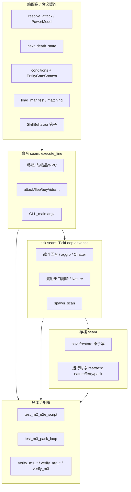

# 04 — 规格符合度与测试架构专家：原始调研报告

## 元信息

| 项 | 内容 |
|---|---|
| 角色 | 规格符合度与测试架构专家（兼 QA 架构） |
| 范围 | 截至 M3（含 M0 治理定稿、M1 骨架、M2 可玩场景、M3 UGC 闭环） |
| 日期 | 2026-07-21 |
| 工作区 | `/home/gukt/github/xkx2001-utf8` |
| 方法 | 独立对照：里程碑定义 / spec / ADR / issue AC ↔ `engine/tests/` + `engine/scripts/verify_*.py` + 关键联动源码路径；**不改代码、不与其他专家协商** |
| 测试基线 | `PROGRESS.md`：649 绿；本机 `pytest --collect-only`：649 collected |
| 原则锚点 | ADR-0001（不做 LPC 行为等价）；测试只锁新引擎自身 spec/契约 |

---

## Executive summary

**总判：M0–M3 里程碑验收口径整体达标，测试分层（纯函数 / 命令 seam / tick seam / 剧本 e2e / verify 矩阵）已成形且与 M1/M2/M3 Testing Decisions 高度同构；停 M3 期间的主要风险不在「有没有测试」，而在「契约层缺口 + 规格/票状态漂移 + 若干联动路径只部分锁死」。**

- **里程碑符合度**：M0 定稿、M1 骨架闭环、M2「一条 MVP 场景端到端可玩」、M3「包外创作→加载→校验→可玩一次」——以 `PROGRESS.md`、收口票（M2-26 / M3-05）与对应 e2e/verify 证据看，**均已兑现**。
- **测试资产**：约 649 条 pytest + M1/M2/M3 人读 verify 脚本（且 M2/M3 矩阵已回挂 pytest，防脚本漂移）。
- **最大规格缺口**：ADR-0004 承诺的 **Effect 生命周期机制（stacking / tick·wallclock / handler）在代码与测试中均不存在**；`DemoPoisonStrikeBehavior` 仅一次性伤害加成，不是持续效果。M2 US23「昏迷后自然恢复/自动醒来」亦未见实现与测试。
- **联动达标画像**：战斗×死亡、坐骑×地形×渡船、包加载×存档重挂、门禁×门派 — **基本达标**；战斗×效果、战斗事件点契约、昏迷自然恢复、多玩家同房广播、全命令同名消歧、默认 CLI 进 M2 场景 — **部分或未达标**（部分属 Out of Scope，需在漂移清单里显式标定）。
- **停 M3 加固优先级**：P0 补契约与漂移澄清；P1 加固脆弱 e2e/联动；P2 治理卫生（票 Status）与可选能力面。

---

## 里程碑符合度矩阵

判定口径：`符合` = 里程碑定义 + 对应 spec 承诺的验收路径有实现且有自动化锁死；`部分` = 主体可玩/可测但有明确未兑现用户故事或契约空洞；`不符合` = 里程碑定义未兑现。

| 里程碑 | 定义来源 | 承诺（摘要） | 实现 / 测试证据 | 符合度 | 备注 |
|---|---|---|---|---|---|
| **M0** | [07-governance](../../mvp-scope/issues/07-governance-cost-tracking.md) | mvp-scope 全票解决 + `CLAUDE.md` 重写 | 10/10 票 resolved；`CLAUDE.md` 架构不变量与 ADR-0001～0006 | **符合** | 无代码验收；治理产物即验收物 |
| **M1** | 07 + [m1/spec.md](../../m1-core-engine-skeleton/spec.md) + extension | 空场景 + 命令/移动/门/存档 + 扩展（物品/NPC/Nature/条件/事件） | `test_commands`/`doors`/`save`/`tick`/`scene_loader`/`items_extension`/`npc_extension`/`nature`/`conditions`/`domain_events`；`just verify-items/npc/nature` + `test_verify_m1_*_matrix` | **符合** | 个别 issue Status 未刷（见漂移） |
| **M2** | 07 + [m2/spec.md](../../m2-mvp-scene-playable/spec.md) + 票 26 | 战斗/成长/死亡/金钱/门派/坐骑交通 + 六分区连通 + 端到端剧本 | `test_m2_e2e_script.py`；`test_combat*`/`death*`/`mount`/`ferry`/`terrain`/`factions`/`…`；`just verify-m2` + `test_verify_m2_matrices.py` | **部分→接近符合** | 玩法主路径达标；**Effect 子系统与昏迷自然恢复相对 ADR-0004 / US23 缺口**；若干票 Status 仍 `ready-for-agent` |
| **M3** | 07 + [m3/spec.md](../../m3-ugc-loop-creation-surface/spec.md) + 票 05 + ADR-0005 | 包外 manifest + `--pack`/`--validate` + 非武侠示例包 + e2e | `test_pack_manifest`/`test_load_pack`/`test_main_cli`/`test_m3_pack_loop`/`test_verify_m3_matrix`；`just verify-m3`；example-pack 在 `.scratch/.../example-pack/` | **符合** | 刻意最小切片；示例包故意不含战斗/坐骑 |
| **M4** | 07 | 商业化数据模型，不计费 | 未开始（`PROGRESS.md` Next Up） | **不适用** | 本轮不评审实现 |

### 按 M2/M3 块的细粒度快照（相对各自 Testing Decisions）

| 块 / 能力 | Spec 要求的测试 seam | 主要测试文件 | 判定 |
|---|---|---|---|
| M2-A 战斗七步 + PowerModel | 纯函数 + seeded RNG | `test_combat.py` | 达标 |
| M2-A 交战/flee/tick 结算 | 命令 + tick | `test_combat_engagement.py`；`verify_m2_combat` | 达标 |
| M2-A SkillBehavior 钩子 | 纯函数接线 | `test_skill_behavior_hooks.py` | 达标（一次性钩子；非 Effect） |
| M2-A 战斗事件点 | 契约锁定形状 | **缺专用测试**（源码有 `ON_BEFORE_COMBAT_ROUND` 等） | **未达标（契约）** |
| M2-B 成长/learn/practice | 命令 seam | `test_character_growth.py`/`learn`/`practice`/`skills` | 达标 |
| M2-C 死亡状态机 | 纯函数 | `test_death.py` | 达标 |
| M2-C 死亡流程/掉落/重生 | 命令/流程 | `test_death_flow.py`；e2e 战败分支 | 达标（流程版）；自然醒来未做 |
| M2-D 金钱商店 | 命令 | `test_currency_shop.py`；场景票 | 达标 |
| M2-E 门派/门禁 | 命令 + EntityGateContext 契约 | `test_factions`/`entry_guard`/`learn` | 达标（含协议 `isinstance` 契约） |
| M2-F 坐骑/地形/渡船 | 命令 + tick + restore | `test_mount`/`terrain`/`ferry`；场景 `test_scene_wild_road_ferry` | 达标 |
| M2-G aggro / spawn / 消歧 | tick / 命令 | `test_aggro`/`spawner`/`disambiguation`；e2e spawn 复核 | 达标（消歧仅 ask/attack 最小档） |
| M2-H 六分区 + 剧本 | e2e | `test_m2_e2e_script.py`；`verify_m2_journey` | 达标 |
| M3-A/B/C/D 包闭环 | 纯函数/组合/CLI/剧本 | `test_pack_manifest`/`load_pack`/`main_cli`/`m3_pack_loop` | 达标 |

---

## 测试覆盖地图

### 分层总览

### 按文件簇的覆盖表

| 层级 | 代表路径 | 规模感（约） | 覆盖主题 |
|---|---|---|---|
| 单元/纯函数 | `test_combat.py`, `test_death.py`, `test_conditions.py`, `test_parsing.py`, `test_matching.py`, `test_skill_behavior_hooks.py`, `test_pack_manifest.py` | 中 | 算法确定性、协议形状、manifest 校验 |
| 命令集成 | `test_commands.py`, `test_doors.py`, `test_combat_engagement.py`, `test_mount.py`, `test_currency_shop.py`, `test_factions.py`, `test_entry_guard.py`, `test_disambiguation.py`, … | 大 | 可观察消息 + 组件状态 |
| Tick 集成 | `test_tick.py`, `test_aggro.py`, `test_ferry.py`, `test_nature.py`, `test_npc_extension.py`（Chatter）, `test_spawner.py` | 中 | 时间推进副作用 |
| 场景内容 | `test_scene_huashan.py`, `yangzhou_*`, `shaolin`, `wild_road_ferry`, `test_scene_loader.py` | 中 | 官方 MVP YAML 可玩切片 |
| 存档 | `test_save.py` + 各子系统 `*_save_restore` | 中高 | 崩溃恢复级耐久；交战/骑乘/昏迷 marker |
| 包/CLI | `test_load_pack.py`, `test_main_cli.py`, `test_m3_pack_loop.py` | 中 | M3 契约 |
| E2E 剧本 | `test_m2_e2e_script.py`, `test_m3_pack_loop.py` | 关键门禁 | 里程碑收口 |
| Verify 矩阵 | `scripts/verify_m*.py` + `test_verify_*_matrix.py` | 人读 + CI 双轨 | 防脚本与引擎漂移 |

### 人读 verify ↔ pytest 双轨

| 命令 | 脚本 | pytest 回挂 |
|---|---|---|
| `just verify-items/npc/nature` | `verify_m1_*.py` | `test_verify_m1_*_matrix.py` |
| `just verify-m2`（及分项） | `verify_m2_*.py` | `test_verify_m2_matrices.py` |
| `just verify-m3` | `verify_m3_pack_loop.py` | `test_verify_m3_matrix.py` |

这是当前测试架构的强项：**正式门禁在 pytest，verify 给人看，矩阵测试防止两套真相**。

---

## 联动测试达标评估

评分：`达标` / `部分` / `未达标`。证据优先引用测试文件，其次源码。

### 1. 战斗 × 效果 × 死亡/恢复

| 子链路 | 判定 | 证据 |
|---|---|---|
| 交战 → tick 扣血 → 可观察播报 | **达标** | `test_combat_engagement.py::TestCombatTick`；`verify_m2_combat` |
| 气血归零 → 昏迷 → 再击 → 惩罚复活 | **达标** | `test_death_flow.py::test_first_deplete_unconscious_second_kills_and_revives`；`test_m2_e2e_script.py::TestM2PlayerDefeatBranch` |
| 免死区只昏迷不死 | **达标** | `test_death_flow.py::test_no_death_zone_stays_unconscious`；华山木桩场景 |
| NPC 击杀掉落/经验 + respawn | **达标** | `test_death_flow.py::TestNpcDeathAndLoot`；e2e spawn wipeout |
| **持续 Effect（中毒/衰减/叠加）** | **未达标** | 全仓库无 `StackingPolicy`/`EffectMode`/`EffectHandler`；ADR-0004 要求引擎内嵌；`DemoPoisonStrikeBehavior` 明确「不实现完整 buff」 |
| **昏迷后自然恢复/自动醒来（US23）** | **未达标** | 规格写「等待自然恢复或被治疗，一定时间后自动醒来」；实现仅「二次归零才死亡/复活」，无 tick 苏醒逻辑与测试 |
| SkillBehavior × 真实 World tick 致死 | **部分** | 钩子仅在纯函数层测通；无「带毒招式在场景里打到死亡流程」的联动测 |
| 战斗事件点 veto / end | **部分** | 源码分发存在；`test_death_flow` 覆盖 `on_before_death` Deny；**战斗轮** `ON_BEFORE_COMBAT_ROUND` 无契约测试 |

### 2. 命令 × 房间 × 可见性/广播

| 子链路 | 判定 | 证据 |
|---|---|---|
| `say` / Chatter → `pending_messages` | **达标** | `test_npc_extension.py::TestSayBroadcast`；Chatter 确定性测 |
| 非 `PlayerSession` 假人不收广播 | **达标** | 同上 + `test_nature.py` 户外广播副本计数 |
| Nature 相位户外广播 | **达标** | `test_nature.py` pending_messages 断言 |
| **两名真实玩家同房互收广播** | **部分/未达标** | 引擎预留 `pending_messages` 多玩家通道，但 MVP 单玩家；无双 `PlayerSession` 同房集成测 |
| look 列同房 NPC/物品 | **达标** | `test_commands.py` / 场景测 |

### 3. 内容包加载 × 运行时对象 × 存档恢复

| 子链路 | 判定 | 证据 |
|---|---|---|
| `load_manifest` / `load_pack` 组合与错误分层 | **达标** | `test_pack_manifest.py`；`test_load_pack.py`（SceneLoadError 不被吞） |
| restore 后 `pack_manifest is None` 直至 reattach | **达标** | `test_load_pack.py::TestSaveRestoreReattach` |
| CLI `--pack` 存档目录隔离 + 恢复位置/物品栏/manifest | **达标** | `test_m3_pack_loop.py` restore 系列；`test_main_cli.py` |
| `--validate` 不碰 save、坏包退出码 | **达标** | `test_m3_pack_loop.py` bad manifest/scene |
| **pack 路径下战斗中存档恢复（Engaged + pack）** | **部分** | 交战 restore：`test_combat_engagement.py::test_engaged_survives_save_restore`（非 pack）；M3 restore 只测移动/拾取；**未交叉** |
| 示例包能力子集走通 | **达标** | `test_m3_pack_loop.py` 全剧本（门/钥匙/ask/buy） |

### 4. 交通/渡船/坐骑 × 移动规则

| 子链路 | 判定 | 证据 |
|---|---|---|
| ride/unride、人马同步换房 | **达标** | `test_mount.py` |
| Terrain.cost vs Mount.ability 拒行 | **达标** | `test_terrain.py`；`test_scene_wild_road_ferry.py`；e2e「骑不过去」 |
| 骑乘扣坐骑精力、耗尽摔落挂 `Unconscious` | **达标** | `test_terrain.py::test_jingli_exhaustion_dismounts_in_destination` |
| 渡船 tick 翻转出口 + look 状态 + restore 需 reattach | **达标** | `test_ferry.py` |
| e2e：买马→官道→下马→等船过河 | **达标** | `test_m2_e2e_script.py::test_full_mvp_journey_script` |
| **骑乘中渡船过河 / 昏迷骑手与渡船并发** | **部分** | 分测齐全，缺刻意交叉用例 |

### 5. 多实体同房交互

| 子链路 | 判定 | 证据 |
|---|---|---|
| 同名 NPC `ask`/`attack` 序号消歧 | **达标** | `test_disambiguation.py`；`test_scene_yangzhou_hub.py::test_ximen_two_guards_disambiguation` |
| 1v1 第三方无法插入交战 | **达标** | `test_combat_engagement.py::test_one_vs_one_blocks_third_party` |
| 双 aggro 只咬一个未交战玩家 | **达标** | `test_aggro.py::test_already_engaged_player_not_re_aggroed` |
| 堆叠物品 `get 铜钱 N` | **达标** | `test_items_extension.py`（Stackable 语义） |
| **全命令 present 等价（get/look/drop/give 同名非堆叠）** | **未达标（相对可选加码）** | M2 US60c 默认最小档；无 get/look 实体序号测（与堆叠数量语法并存风险未锁） |
| 多玩家同房 | **未达标** | 超出当前单玩家 MVP；通道预留未测 |

---

## 规格漂移清单

### A. Spec / ADR 写了，代码或测试未跟

| ID | 漂移 | 严重度 | 说明 |
|---|---|---|---|
| D1 | ADR-0004 Effect 生命周期 | **高** | 引擎不变量写明 Effect 调度/衰减/移除；代码仅注释预留「Effect 衰减」；无类型、无测试 |
| D2 | M2 US23 昏迷自然恢复/自动醒来 | **中** | 用户故事明文；实现为「等再挨打才死」容错，无苏醒时钟 |
| D3 | 战斗事件点契约测试 | **中** | Spec Testing Decisions / M1 扩展「钩子形状契约」精神；死亡事件有测，战斗轮事件无测 |
| D4 | M2 票 Status 与实现脱节 | **中（治理）** | 至少 `16/17/18/19/20` 仍标 `ready-for-agent` 且 AC 未勾，但对应测试已存在（如 `test_aggro.py`、`test_death_flow.py`、`test_skill_behavior_hooks.py`、`test_disambiguation.py`）；`PROGRESS` 称 M2 完成 |
| D5 | M1 个别票 Status | **低** | 如 `04-doors` 仍 `ready-for-agent`（门系统实测已久） |

### B. 代码/测试有了，规格刻意排除或产品缺口（需标成「已知非漂移」）

| ID | 项 | 说明 |
|---|---|---|
| K1 | 默认 `python -m mud_engine` 不进 M2 场景 | M3 Out of Scope 已写明；易被误认为漏测 |
| K2 | 示例包不含战斗/坐骑 | M3 刻意子集；题材无关证明成立，但「包外 × 战斗」交叉未锁 |
| K3 | riposte / ThreatTable / PvP | Spec Out of Scope；`_invoke_riposte` no-op |
| K4 | 编辑器/Web 评审台 | ADR-0006；`--validate` 是契约替身 |

### C. 测试脆弱性（非功能缺失，但是质量债）

| ID | 模式 | 例子 | 风险 |
|---|---|---|---|
| F1 | 宽 `assert any("…关键词" in …)` | e2e / 场景测大量中文子串 OR | 文案微调假绿/假红；约 200+ 处 `assert any`/`in line` 风格 |
| F2 | 单测超长剧本 | `test_full_mvp_journey_script` 串联全路径 | 失败定位差；票 26 已承认「刻意单测」 |
| F3 | e2e 作弊式保胜 | 野外战强制拉高玩家 `qi` | 测「能打赢」而非「默认数值可赢」 |
| F4 | 连通图把渡口当作理论连通 | `_reachable_keys` 硬编码 ferry 对 | 与真实出口动态不一致（有意简化，需文档化） |

### D. 缺失的契约测试（建议清单化）

1. `ON_BEFORE_COMBAT_ROUND` Deny 阻止本回合结算；`ON_COMBAT_END` 在 flee/击杀时触发且参数稳定。
2. Effect 子系统一经落地：stacking 四枚举 + tick/wallclock 衰减的确定性表驱动测试（对齐 ADR-0004）。
3. `reattach_*` 全家福：nature / ferry / combat / entry_guards / pack 在一次 CLI restore 路径上的集成（现分散）。
4. 双 `PlayerSession` 同房 `room_say`（即便产品仍单玩家，作为通道契约）。
5. 同名非堆叠物品 `get/look` 序号 vs Stackable `get name N` 数量语法冲突用例。

---

## 改进建议 P0 / P1 / P2（停 M3 期间）

### P0 — 停 M3 必须澄清或补齐（阻塞「规格诚实度」）

1. **写清 Effect 边界现状**：要么补最小 Effect 骨架 + 契约测（哪怕只有 unique + tick 衰减 + 一个示范中毒），要么在 ADR-0004 / M2 spec 追加「落地修订：M2 仅 SkillBehavior 瞬时钩子，Effect 调度推迟 M4+」——**禁止维持「ADR 写了、代码没有」的静默状态**。
2. **澄清 US23 昏迷苏醒**：补 tick 苏醒；或改用户故事为「仅二次打击致死，无自然苏醒」，并加回归测锁定当前语义。
3. **刷票 Status / AC**：把已实现的 M2-16～20 等改为 resolved，勾选 AC，避免后续 session 误以为未做。
4. **战斗事件点最小契约测**（各 1～2 条）：before veto + end 触发。不扩功能，只锁形状。

### P1 — 联动加固（显著降回归风险）

1. **交叉用例**：`load_pack`（或 MVP scene）+ 交战中 save/restore + reattach_pack_manifest / attach_combat。
2. **SkillBehavior 进 World**：示范毒招在真实 tick 战斗中改伤害并进入死亡流程（仍可不做完整 Effect）。
3. **拆分/加强 e2e**：保留全路径，但把「战败分支 / 渡船等待 / 门禁钢刀」拆成可独立失败的 parametrize 或子测（降低 F2）。
4. **收紧关键断言**：里程碑门禁步骤对**稳定消息码或结构化结果**断言（若暂无消息码，至少固定完整句而非宽 OR）。
5. **骑乘 × 渡船** 一条：骑马到渡口、等船、过河后坐骑同房。

### P2 — 可选增强 / 卫生

1. 默认 CLI 进 M2 或 `--scene mvp` 开关（产品票，非测试 alone）。
2. 全命令同名消歧加码票 + 与 Stackable 语法冲突表。
3. 双玩家广播契约（为未来多人预埋）。
4. 统计/覆盖率门禁（行覆盖非目标；可对「事件点注册表」「能力注册表」做枚举完备性测）。
5. issue 模板要求：`/implement` 结束必须 Status=resolved，与 `PROGRESS` 同步。

---

## 待交叉对抗争议点（≥5）

供后续 Phase 2 与其他专家对抗，本专家先立靶：

1. **Effect 是否算 M2「未完成」？**  
   ADR-0004 将其列为引擎不变量；M2 spec 又把「完整 buff」淡化为钩子示范。架构专家可能主张「边界已定必须补」；产品/进度视角可能主张「里程碑可玩已够」。**对抗焦点：符合度矩阵 M2 该标「符合」还是「部分」。**

2. **US23 自然苏醒是功能债还是文案过承诺？**  
   若死亡设计刻意「二次打击才死」而无苏醒，则规格应改而非补时钟。对抗影响 P0 选「补实现」还是「改 spec」。

3. **e2e 强制拉高气血是否可接受？**  
   锁的是管线可达性还是默认数值可玩性？数值调参与测试职责边界。

4. **票 Status 漂移是否算验收失败？**  
   代码绿但 issue 未关：治理专家可能升级为流程 P0；工程专家可能视为文档噪音。对抗影响「M2 完成」声明的可信度。

5. **多玩家同房广播要不要在单玩家 MVP 测？**  
   测则增加维护面；不测则 `pending_messages` 通道成为无契约死代码。对抗焦点：契约测试最小集是否包含「未来接缝」。

6. **M3 示例包故意无战斗，是否削弱「题材无关」证明？**  
   题材无关已由科幻包证明声明式能力可复用；但「包外加载 × 战斗系统」仍是隐藏耦合风险。对抗：P1 交叉测是否应升 P0。

7. **默认 CLI 仍指向 M1 场景**  
   文档已排除，但玩家/评审手感上「M2 完成却默认玩不到」。对抗：算不算产品漂移，是否挤进停 M3 清单。

---

## 证据索引

### 治理 / 规格

| 路径 | 用途 |
|---|---|
| `PROGRESS.md` | 活状态：M1/M2/M3 完成、649 绿、M4 Next |
| `CLAUDE.md` | 架构不变量；ADR-0001 测试边界 |
| `.scratch/mvp-scope/issues/07-governance-cost-tracking.md` | M0–M4 定义 |
| `.scratch/m1-core-engine-skeleton/spec.md` / `spec-extension.md` | M1 验收与 Testing Decisions |
| `.scratch/m1-core-engine-skeleton/research/04-dsl-dynamic-rules.md` | 测试/契约与 Effect 预留论述 |
| `.scratch/m2-mvp-scene-playable/spec.md` | M2 用户故事与 Testing Decisions |
| `.scratch/m2-mvp-scene-playable/issues/26-scene-integration-and-e2e-script.md` | M2 收口 AC |
| `.scratch/m3-ugc-loop-creation-surface/spec.md` | M3 Testing Decisions |
| `.scratch/m3-ugc-loop-creation-surface/issues/05-e2e-verification-and-docs.md` | M3 收口 AC |
| `docs/adr/0001-*.md`～`0006-*.md` | 尤其 0001（无 LPC 等价）、0004（战斗/Effect）、0005/0006（UGC 面） |

### 关键测试（按主题）

| 主题 | 路径 |
|---|---|
| M2 e2e | `engine/tests/test_m2_e2e_script.py` |
| M3 e2e / validate / CLI restore | `engine/tests/test_m3_pack_loop.py` |
| 战斗纯函数 | `engine/tests/test_combat.py` |
| 交战/flee/tick/restore | `engine/tests/test_combat_engagement.py` |
| 技能钩子 | `engine/tests/test_skill_behavior_hooks.py` |
| 死亡状态机 | `engine/tests/test_death.py` |
| 死亡流程/NPC 掉落 | `engine/tests/test_death_flow.py` |
| Aggro | `engine/tests/test_aggro.py` |
| 坐骑 | `engine/tests/test_mount.py` |
| 地形/摔落 | `engine/tests/test_terrain.py` |
| 渡船 | `engine/tests/test_ferry.py` |
| 门禁契约 | `engine/tests/test_entry_guard.py` |
| 消歧 | `engine/tests/test_disambiguation.py` |
| 广播 | `engine/tests/test_npc_extension.py` |
| 存档耐久 | `engine/tests/test_save.py` |
| Pack | `engine/tests/test_pack_manifest.py`, `test_load_pack.py`, `test_main_cli.py` |
| Verify 回挂 | `engine/tests/test_verify_m1_*_matrix.py`, `test_verify_m2_matrices.py`, `test_verify_m3_matrix.py` |

### 验证脚本 / 命令

| 路径 | 用途 |
|---|---|
| `justfile`（`verify-items`…`verify-m3`） | 人读矩阵入口 |
| `engine/scripts/verify_m1_*.py` | M1 能力面 |
| `engine/scripts/verify_m2_*.py` | M2 能力面 + journey |
| `engine/scripts/verify_m3_pack_loop.py` | M3 包闭环转录 |
| `engine/scripts/verify_harness.py` | 共享断言 helper |

### 关键实现（联动路径抽样）

| 路径 | 用途 |
|---|---|
| `engine/src/mud_engine/combat.py` | 七步 `resolve_attack`；riposte no-op |
| `engine/src/mud_engine/combat_system.py` | tick 交战、战斗事件点、播报 |
| `engine/src/mud_engine/death_flow.py` | 昏迷/死亡/复活；`UNCONSCIOUS_BLOCKED_VERBS` |
| `engine/src/mud_engine/skills.py` | `DemoPoisonStrikeBehavior`（非 Effect） |
| `engine/src/mud_engine/pack.py` | `load_pack` / `reattach_pack_manifest` |
| `engine/src/mud_engine/ai.py` | aggro / spawn_scan |
| `engine/src/mud_engine/commands.py` | `room_say`、骑乘地形、商店等 |
| `.scratch/m3-ugc-loop-creation-surface/example-pack/` | 非武侠包外示例 |

---

## 本专家结论一句话

**以「里程碑可玩 + 自身契约」为准，M0–M3 可以宣布交付；以「ADR-0004 字面不变量 + 联动契约完备」为准，停 M3 期间应先做 P0 规格诚实化与战斗/死亡契约补强，再谈 M4。**
