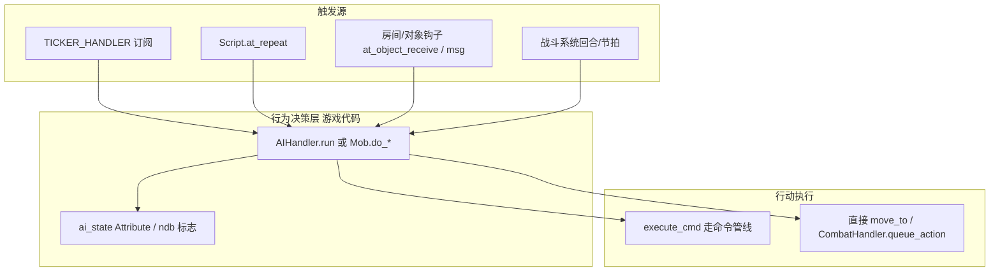
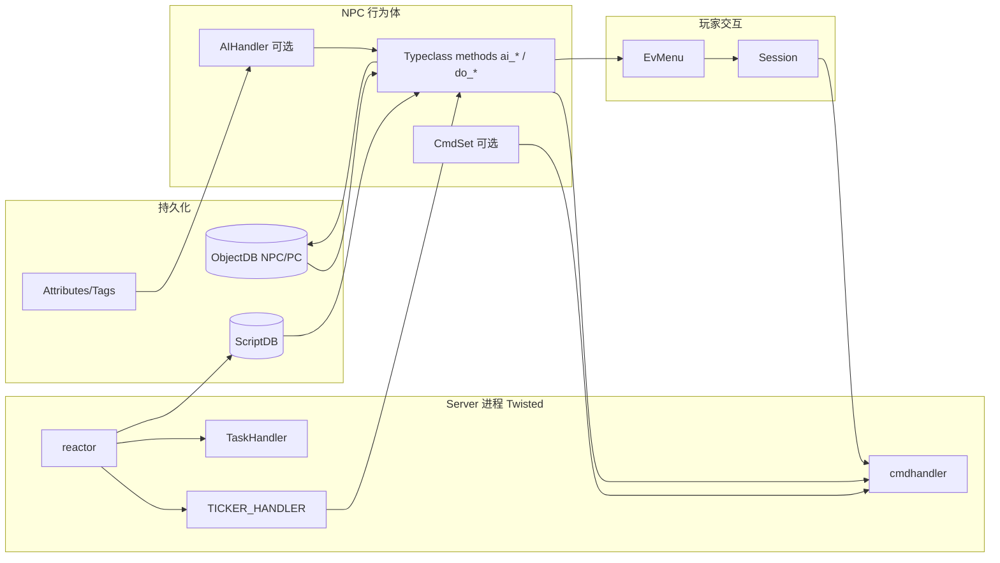

# 调研：Evennia NPC / AI Agent 设计（一手源码）

> **范围**：Evennia **6.1.0**（`/home/gukt/github/evennia`，`evennia/VERSION.txt`）核心源码 + 仓库内官方 docs（`docs/source/`）+ contrib 教程实现。  
> **目标**：弄清 NPC / AI /「Agent」在 Evennia 中是否为一等公民、如何挂载行为、与 Session/Account/命令管线如何分叉。  
> **非目标**：不复述整篇 Evennia vs mud_engine 平台对比（见 [vs-mud-engine-2026-07-23.md](./vs-mud-engine-2026-07-23.md)）；不依赖二手博客。  
> **一手原则**：每条重要论断带路径 + 符号 + 可定位片段。

---

## 1. 摘要（≤10 行）

1. Evennia **没有**名为「AI Agent」的一等公民；核心只有 `DefaultObject` / `DefaultCharacter` / `DefaultScript` / Handler 组合。
2. NPC 不是独立 DB 类型，而是 **未 puppet（或永不 puppet）的 Object/Character 用法**；官方明确两种流派（`Objects.md`）。
3. 「AI」在官方教程里被刻意降维为 **if 状态机 + 定期 tick**（`Beginner-Tutorial-AI.md`），不是 LLM/GOAP/行为树框架。
4. 行为驱动三件套：**事件钩子**（`msg` / `at_object_receive`）+ **TickerHandler 订阅** + **Script.timer**；决策侧常再走 `execute_cmd` 复用命令管线。
5. EvAdventure 的 `AIHandler` 只存状态并调度 `ai_<state>()`；**谁、何时调用 `.ai.run()` 留给游戏系统**（文档原话）。
6. 对话/商店/任务是 **EvMenu + CmdSet/Attribute** 模式；任务进度挂在玩家 `.quests`，不是 NPC 内置 quest AI。
7. `contrib.rpg.llm.LLMNPC` 是可选 LLM 对话层，与移动/战斗 AI 正交。
8. 离线世界仍运转靠 Twisted reactor 上的 Script / Ticker / TaskHandler，不依赖玩家 Session。
9. Prototype/spawner 负责「刷怪」形状，不负责大脑；大脑在 typeclass 方法与 handler 里。
10. 对本项目：可借鉴「钩子表面 + tick/事件分工 + 命令复用」；勿照搬 Django/Typeclass/Attribute 持久化与「一切皆 Python 子类」。

---

## 2. 系统地图

### 2.1 模块布局（与 NPC/AI 相关）

| 路径 | 角色 |
|---|---|
| `evennia/objects/objects.py` | `DefaultObject` / `DefaultCharacter`：世界实体、移动、`execute_cmd`、钩子表面 |
| `evennia/objects/models.py` | `ObjectDB`：Django 行持久化 |
| `evennia/accounts/accounts.py` | `DefaultAccount`：登录身份；可 puppet Character |
| `evennia/accounts/bots.py` | `Bot`：**Account 级**外部 bot（IRC 等），不是 in-game NPC AI |
| `evennia/scripts/scripts.py` | `DefaultScript`：无物理存在的系统/计时器对象 |
| `evennia/scripts/tickerhandler.py` | `TickerHandler` / `TICKER_HANDLER`：按间隔订阅回调 |
| `evennia/scripts/taskhandler.py` | `TaskHandler`：一次性/延迟 deferred 任务 |
| `evennia/prototypes/spawner.py` | 字典原型生成实体（含 mob 模板） |
| `evennia/typeclasses/attributes.py` / `tags.py` | Attribute / Tag：AI 状态常见载体 |
| `evennia/utils/evmenu.py` | 对话/商店菜单 |
| `evennia/contrib/tutorials/evadventure/{ai,npcs,quests}.py` | 教程级状态机 AI + NPC 族 |
| `evennia/contrib/tutorials/tutorial_world/mob.py` | 更完整的 ticker 驱动 mob |
| `evennia/contrib/tutorials/talking_npc/` | CmdSet+EvMenu 静态对话 NPC |
| `evennia/contrib/rpg/llm/llm_npc.py` | LLM 对话 NPC |

### 2.2 概念关系（文字）

```
Session ──puppet──► Account ──puppet──► Character (PC)
                         │
                         └──（可选）Bot Account：协议侧 bot，非 mob AI

ObjectDB 行 + Typeclass
  ├─ DefaultObject          ← 物品 / TalkingNPC / Merchant 常见基类
  ├─ DefaultCharacter       ← PC；也常作 NPC/Mob 基类（un-puppeted）
  ├─ DefaultRoom / Exit
  └─ （无 AIAgent 类）

ScriptDB 行 + DefaultScript ← 战斗 tracker / 天气 / bodyfunctions；可挂 obj.scripts
TICKER_HANDLER              ← 轻量「订阅 interval → 回调」；可跨 reload 持久化订阅表
TaskHandler                 ← 单次延迟回调（Twisted deferLater）

Handler（约定模式，非基类）
  ├─ .attributes / .tags / .scripts / .cmdset / .sessions（引擎内置）
  └─ .ai / .quests（游戏侧 lazy_property，见 EvAdventure）
```

### 2.3 与平台对比笔记的交叉引用

平台层（Portal/Server、Django、CmdSet 合并、Prototype）见 [vs-mud-engine-2026-07-23.md](./vs-mud-engine-2026-07-23.md)。本文只补 **NPC 行为体** 切片。

---

## 3. A. 概念与分层（源码证据）

### 3.1 Object / Character / Account / Session / Handler / Script

| 术语 | Evennia 含义 | 出处 |
|---|---|---|
| **Object** | 一切有 in-game 存在的实体（角色、椅、怪、房、出口）的统称；根类 `DefaultObject` | `docs/source/Components/Objects.md` L11–20；`DefaultObject` docstring `objects.py` L195–200 |
| **Character** | 「通常由 Session/Account puppet 的化身」；`DefaultCharacter(DefaultObject)` | `DefaultCharacter` docstring `objects.py` L3018–3022；`Characters.md` L19–23 |
| **Account** | 登录账号；与世界内 Object 分离 | `Objects.md` Message-path 图 L3–9 |
| **Session** | 客户端连接；经 Account 再 puppet Object | 同上；`DefaultObject.sessions` handler 文档 L246–247 |
| **Script** | **无物理存在**、可存档、可有 timer 的 Typeclass；系统态容器 | `Scripts.md` L5–11；`DefaultScript` docstring `scripts.py` L677–683 |
| **Handler** | **设计约定**：`lazy_property` 挂在对象上的功能组（`.ai`、`.attributes`）；非独立 DB 类型 | `Tutorial-Persistent-Handler.md` L3–9；`AIHandler` `evadventure/ai.py` L45–54 |

### 3.2 NPC 是独立类型吗？

**否。** 官方文档：

> Depending on your game, this also goes for NPCs and monsters (in some games you may want to treat NPCs as just an un-puppeted Character instead).  
> — `docs/source/Components/Objects.md` L39

两种常见实现（均在官方材料中出现）：

1. **`DefaultCharacter` 子类 + `is_pc = False`**（EvAdventure）  
   - `EvAdventureNPC(LivingMixin, DefaultCharacter)`，`is_pc = False`  
   - 出处：`evennia/contrib/tutorials/evadventure/npcs.py` L21–45  
2. **`DefaultObject` 子类**（TalkingNPC、Merchant 教程）  
   - `TalkingNPC(DefaultObject)`  
   - 出处：`talking_npc.py` L134–144；`Tutorial-NPC-Merchants.md` `NPCMerchant(Object)`

`DefaultCharacter` 会：

- 加上角色锁（不可被捡起等）与 **默认 Character CmdSet**（`basetype_setup` → `cmdset.add_default(settings.CMDSET_CHARACTER)`）  
  — `objects.py` L3206–3228  
- 默认 `call:false()`：外部不能直接「调用挂在该 Character 上的命令」  
  — 同段 L3217–3226  
  → 因此「在 NPC 上挂 `talk` CmdSet」更常见于 **Object 基类**（`DefaultObject.basetype_setup` 默认 `call:true()`，`objects.py` L2011–2021）；Character 系 NPC 多用 **玩家侧命令** 调 `npc.at_talk(...)`（EvAdventure）。

### 3.3 有没有「AI Agent」一等公民？

**明确没有。**

| 检索面 | 结果 |
|---|---|
| 核心包类名 | 无 `AIAgent` / `Agent` / `Brain` 基类 |
| 官方 AI 教程 | 「AI」= 状态机 + `.ai.run()`；Handler 存在游戏代码里 | `Beginner-Tutorial-AI.md` L6–34 |
| contrib | `AIHandler` / `AIMixin` 仅在 `evadventure/ai.py`；`tutorial_world.Mob` 自管状态机 |
| `accounts/bots.py` | `Bot` 是 **Account**，用于 IRC/RSS 等桥接，不是 mob | `bots.py` L1–4, L71–75 |

结论：Evennia 的「行为体」= **Object/Character +（可选）Script/Ticker + Handler/方法 + Attribute 状态** 的组合，而非引擎级 Agent 运行时。

### 3.4 PC vs NPC：共同点与分叉

| 维度 | 共同点 | 分叉 |
|---|---|---|
| 持久化 | 同为 `ObjectDB` + typeclass | 无「NPC 表」 |
| 空间 | 同用 `location` / `contents` / `exits` / `move_to` | — |
| 命令 | 均可 `execute_cmd`（`callertype="object"`） | PC 通常有 Session 回传；NPC 常无 Session，`msg` 可能无人听 |
| Account/Session | — | PC：`account` + `sessions`；NPC：通常无。检测 PC 常用 `obj.has_account` 或 `is_pc` |
| CmdSet | Character 默认有角色命令集 | NPC 可额外挂商店/`talk`；或完全不挂，由房间/玩家命令驱动 |
| 权限 | 同用 locks | 出口 `traverse` 常锁成「仅 PC」以免 mob 走出区域（AI 教程） |
| 生命周期钩子 | `at_object_creation` 等相同 | PC 另有 `at_pre/post_puppet` / `at_post_unpuppet`（`objects.py` L3241+） |

`has_account` 实现（会话计数）：

```449:451:evennia/objects/objects.py
    def has_account(self):
        ...
        return self.sessions.count()
```

tutorial_world 找目标：`obj.has_account and not obj.is_superuser`（`mob.py` L215–219）。  
EvAdventure 找目标：`hasattr(obj, "is_pc") and obj.is_pc`（`ai.py` L63–68）。

---

## 4. B. 生命周期与世界挂载

### 4.1 创建 / 存档 / 加载 / 销毁

| 步骤 | 机制 | 出处 |
|---|---|---|
| 创建 | `evennia.create_object(...)` → `ObjectDB.objects.create_object` | `utils/create.py` L85–117 |
| 首创钩子 | `basetype_setup` → `at_object_creation` → 应用 attrs/tags → `at_object_post_creation` | `objects.py` L1938–1993, L2042–2057 |
| 存档 | Django ORM：对象字段 + Attribute/Tag 表；非单独「NPC 存档 API」 | 平台对比笔记 §3；`ObjectDB` |
| 热加载后重建 | `at_init()`：typeclass 从缓存恢复时调用（至少每次 server reload） | `objects.py` L317–318 |
| 原型刷怪 | `spawner.spawn(prot)`，可设 `typeclass`/`attrs`/`tags`/`location` | `prototypes/spawner.py` L1–71 |
| 销毁 | `obj.delete()`；`at_object_delete` 可中止 | `objects.py` L311–314 |

EvAdventure NPC 创建示例：`at_object_creation` 设满血并 `tags.add("npcs", category="group")`（`npcs.py` L91–97）。

### 4.2 进入房间 / 移动 / 感知

空间模型完全依赖 Object 拓扑：

- `location`：当前容器（房间通常也是 Object）  
- `contents`：内部对象列表  
- `exits`：本位置上的出口对象  
- `move_to(destination, ...)`：移动管线，依次触发 leave/receive 等钩子  

移动钩子链（文档列在 `DefaultObject` docstring）：

`at_pre_move` → `announce_move_from` → … → `destination.at_object_receive` → `at_post_move`  
— `objects.py` L339–354；实现约 L1207–1322 一带。

**感知不是独立感知子系统**，而是：

1. **轮询**：AI tick 时扫 `location.contents` / 邻室 `exit.destination`（`mob.do_patrol` / `do_hunting`）。  
2. **事件**：房间 `at_object_receive` 转发给 NPC（`Tutorial-NPC-Reacting.md`；`mob.at_new_arrival`）。  
3. **消息嗅探**：覆盖 `msg()` 识别 `{"type": "say"}`（`Tutorial-NPC-Listening.md`）。

### 4.3 「离线世界仍运转」靠什么？

Evennia Server 进程内 Twisted reactor 持续运行；与玩家是否在线无关：

| 驱动器 | 用途 | 出处 |
|---|---|---|
| **`TICKER_HANDLER`** | 按秒订阅 typeclass 方法或模块函数；reload 可恢复 | `tickerhandler.py` L1–27, L300–306, L652 |
| **`DefaultScript` timer** | `interval` / `at_repeat`；可挂在对象上或全局 | `scripts.py` L702–749；`Scripts.md` L10–11 |
| **`TaskHandler` / `delay`** | 单次延迟 | `taskhandler.py` L1–12 |
| **战斗 Script** | EvAdventure `CombatHandler` 基类继承 `DefaultScript` | `combat_base.py` L18–21 |

NPC AI **不需要** Session。`execute_cmd` 也可无 session 调用（`objects.py` L929–969），结果不会推给玩家客户端，但命令副作用（移动、攻击）仍会执行。

---

## 5. C. AI / 行为模型

### 5.1 内置 vs contrib 清单

| 实现 | 位置 | 模型 | 备注 |
|---|---|---|---|
| 官方 AI 教程 | `docs/.../Beginner-Tutorial-AI.md` | 状态机 + Handler | 规格说明；与 contrib 同源 |
| EvAdventure `AIHandler` | `contrib/tutorials/evadventure/ai.py` | FSM：`idle/roam/combat/flee` | **不自带 ticker** |
| EvAdventure `EvAdventureMob` | `.../npcs.py` | 状态方法 + `execute_cmd` | WIP；战斗态写 `self.nbd`（疑似 typo，应为 `ndb`） |
| tutorial_world `Mob` | `contrib/tutorials/tutorial_world/mob.py` | 状态机 + **TickerHandler** | 更完整：巡逻/狩猎/攻击/死亡复活 |
| TalkingNPC | `contrib/tutorials/talking_npc/` | 无移动 AI；EvMenu | 静态对话 |
| LLMNPC | `contrib/rpg/llm/llm_npc.py` | 异步 LLM 回复 | 对话层 |
| bodyfunctions | `contrib/tutorials/bodyfunctions/` | Script.on_repeat | 定时「自言自语」示例，非战斗 AI |
| turnbattle | `contrib/game_systems/turnbattle/` | 房间 Script 战斗 | NPC 侧需游戏自接 |
| **GOAP / 行为树 / 通用 Brain** | — | **未找到** | 全库无 goap/BehaviorTree 实现 |

官方对「AI」预期（规划文档）：

> ... difference between a simple state-machine and you spending a lot of time learning [advanced AI] ...  
> — `Beginner-Tutorial-Planning-The-Tutorial-Game.md` L302–307

### 5.2 决策：事件 / tick / 命令模拟

**三者并存，按模式选用。**



1. **定时 tick**：tutorial_world `Mob._set_ticker(interval, hook_key)` → `do_patrol` / `do_attack`（`mob.py` L163–201, L259–297）。  
2. **事件驱动**：`at_new_arrival` 立即切入攻击，避免慢巡逻漏检（`mob.py` L423–434）。  
3. **命令模拟**：`self.execute_cmd(f"attack {target.key}")` / `self.execute_cmd(f"{exi.key}")`（`npcs.py` L318–332；`Beginner-Tutorial-AI.md` L254–261）。  
4. **直接 API**：`move_to`、`combathandler.queue_action(...)`（`npcs.py` L288–312；`mob.py` L321）。

文档明确：**谁以什么频率调用 `.ai.run()` 由其他游戏系统决定**（`Beginner-Tutorial-AI.md` L33）。源码检索显示 EvAdventure 内 **除测试外几乎无人订阅 ticker 去调 `ai.run()`**——即教程 AI 是「大脑 API」，驱动器需自接（缺口见 §9）。

### 5.3 CmdSet / `execute_cmd` / 无 Session 路径

`DefaultObject.execute_cmd`：

```929:969:evennia/objects/objects.py
    def execute_cmd(self, raw_string, session=None, **kwargs):
        """
        Do something as this object. This is never called normally,
        it's only used when wanting specifically to let an object be
        the caller of a command. ...
        """
        ...
        return _CMDHANDLER(self, raw_string, callertype="object", session=session, **kwargs)
```

要点：

- **专为「让 Object 充当命令调用者」**；NPC AI 的标准用法。  
- `session` 可选；无 session 时仍解析/执行命令。  
- 官方 Listening 教程也建议：生产中更高效是直接调命令背后的逻辑，教程用 `execute_cmd` 是为了省事并保证钩子（`Tutorial-NPC-Listening.md` L78–79）。

NPC 作为命令 **提供者**（玩家对 NPC 用 `talk`/`shop`）：

- TalkingNPC：`self.cmdset.add_default(TalkingCmdSet, persistent=True)`（`talking_npc.py` L140–144）  
- 玩家输入合并房间内物体 CmdSet（Command-Sets 文档所述 multimatch）

### 5.4 Attribute / NAttribute / Tags /「记忆」

| 载体 | AI 用途 | 出处 |
|---|---|---|
| **Attribute (`db` / `attributes`)** | 持久 AI 状态：`ai_state`、`past_room`、`patrolling`、`health` | `AIHandler.set_state` → `attributes.add`（`ai.py` L56–58）；`mob.at_object_creation`（`mob.py` L116–128） |
| **NAttribute (`ndb`)** | 非持久运行态：`is_attacking`、`llm_client`、`combathandler` | `mob.at_init`（`mob.py` L97–106）；`LLMNPC.llm_client`（`llm_npc.py` L58–62） |
| **Tags** | 群体：被攻击拉同 tag 入战 | `EvAdventureNPC.group = TagProperty("npcs")`（`npcs.py` L59–61） |
| **chat_memory Attribute** | LLM 每角色对话历史 | `llm_npc.py` L54–56, L75–82 |

`AttributeProperty` 把类字段声明成 Attribute（`npcs.py` L47–57），便于原型/建造者调参。

### 5.5 Scripts vs TickerHandler 分工（NPC AI）

| | **Script** | **TickerHandler** |
|---|---|---|
| 本体 | 独立 `ScriptDB` 行（可挂 `obj`） | 全局订阅表（`ServerConfig` 持久化指令） |
| 适合 | 战斗会话、交易超时、复杂系统态、需 `is_valid` 自销毁 | 「让这个 mob 每 N 秒调一个方法」 |
| NPC 样例 | `CombatHandler(DefaultScript)`；`BodyFunctions` | `Mob._set_ticker`；房间天气 echo |
| 文档定位 | 「系统 storage + 可选 timer」`Scripts.md` L9–11 | 「高效订阅模型」`tickerhandler.py` L4–5 |

tutorial_world 刻意用 Ticker：**同一 idstring 上切换 interval/hook**，实现巡逻慢、战斗快、死亡长冷却（`mob.py` L163–201, L287–297）。

---

## 6. D. 感知、交互、对话

### 6.1 「听到 / 看到」

| 通道 | 做法 | 出处 |
|---|---|---|
| 听到 say | 覆盖 `msg()`，解析 `text=(..., {"type":"say"})`，再 `execute_cmd("say ...")` | `Tutorial-NPC-Listening.md` L51–71 |
| 看到有人进来 | Room.`at_object_receive` → `npc.at_char_entered` / `at_new_arrival` | `Tutorial-NPC-Reacting.md` L63–69；`mob.py` L423–434 |
| 通用消息钩子 | `at_msg_receive` / `at_msg_send` | `objects.py` L365–369 |
| look | `at_look` / `return_appearance` / `at_desc` | `objects.py` L371–386 |

注意：无 Session 的 NPC，`super().msg(...)` 仍应调用——否则日后 `@ic` puppet 该 NPC 会「全盲」（Listening 教程 L69–71）。

### 6.2 对话 / 任务 / 商店模式

| 模式 | 实现要点 | 出处 |
|---|---|---|
| **菜单对话** | EvMenu 节点函数 + `talk` 命令 | `talking_npc.py`；`EvMenu.md` |
| **Talkative NPC** | `menudata` Attribute + `at_talk` → `EvMenu(talker, ...)` | `npcs.py` L115–191 |
| **商店** | NPC 上 `shop`/`buy` CmdSet → EvMenu；货在 `contents` | `Tutorial-NPC-Merchants.md`；`EvAdventureShopKeeper` |
| **任务** | **玩家侧** `.quests` handler；进度 Attribute 在 **quester** 上；NPC 只是触发器/对话入口 | `quests.py` L1–12, L18–30 |
| **LLM 闲聊** | `at_talked_to` + `LLMClient` 异步 | `llm_npc.py` L110–171 |

### 6.3 独立 dialogue / quest / merchant 框架？

**核心引擎：无。** 均为：

- 通用 `EvMenu`  
- 教程/contrib 类与文档 Howto  
- 游戏自定义命令  

不是独立 DialogueDB / QuestEngine 子系统。

另：官方强调 **vNPC（虚拟 NPC）**——大量路人用房间描述/定时 echo 冒充，勿刷数百真实 Object（`Beginner-Tutorial-NPCs.md` L3–5）。

---

## 7. E. 与其它系统的耦合

### 7.1 耦合点表

| 系统 | 耦合方式 |
|---|---|
| **移动** | AI 调 `move_to` 或出口名 `execute_cmd`；出口 `traverse` lock 隔离 mob 活动区 |
| **战斗** | 教程：`execute_cmd("attack ...")` 或 `CombatHandler.queue_action`；CombatHandler 常为 Script |
| **频道** | 默认与 NPC AI 弱耦合；Bot Account 才接外部频道 |
| **Locks** | `access(..., "traverse")`、命令 `cmd:`、`call:`、`puppet:` |
| **Prototypes/spawner** | 刷出带 typeclass/attrs 的实例；不内含 AI 调度器 |
| **权限** | NPC 可有 permissions；玩家权力通常放 Account（`Permissions.md`） |

### 7.2 全局服务关系图



---

## 8. 生命周期时序（典型 Mob）

以 **tutorial_world.Mob** 为完整参考实现：

```
create_object(Mob)
  → at_object_creation: 默认 is_dead=True, 挂 MobCmdSet, 记 pace
admin: mobon
  → set_alive → start_patrolling
       → TICKER_HANDLER.add(patrolling_pace, do_patrol)
do_patrol tick:
  → 同房有 has_account → start_attacking（换更快 ticker → do_attack）
  → 否则随机 traverse 通过的 exit.move_to
房间通知 at_new_arrival:
  → 可立即 start_attacking（事件捷径）
do_attack:
  → execute_cmd("slash Target") 等
  → 目标 health<=0 → move_to 牢房
自身被击倒:
  → set_dead → location=None → ticker → set_alive（复活）
server reload:
  → at_init 重建 ndb 标志；TickerHandler.restore 重订阅
```

EvAdventure 理想时序（文档）：外部系统周期性 `mob.ai.run()` → `ai_roam` / `ai_combat`…；**当前仓库内驱动器未完整接线到 ticker**（见开放问题）。

---

## 9. 开放问题 / 未覆盖处

1. EvAdventure `AIHandler` 的 **生产级调度器**（全局 AI tick？进战才 tick？）在 contrib 内未完成闭环；文档把调度权甩给「其他游戏系统」。  
2. `EvAdventureMob.ai_combat` 使用 `self.nbd.combathandler`（`npcs.py` L283）——与全库惯用 `ndb` 不一致，疑似未修 WIP。  
3. `AIHandler.get_traversable_exits` 中 `exi.access(self, "traverse")` 的 `self` 是 Handler 而非 Object（`ai.py` L81）；tutorial 文档同样写法——锁检查可能未按预期落到 mob。  
4. 未深挖：第三方游戏（Arx 等）如何挂 AI（`Tutorial-Using-Arxcode.md` 仅链接向）；本次严格限一手仓库。  
5. 未系统评测：千级 mob 同时 ticker 的性能（TickerPool 按 interval 合并，但回调仍 O(订阅数)）。  
6. `MonitorHandler` / `OnDemandHandler` 与 NPC 感知的潜在关系未展开（存在于 `scripts/`，非教程主路径）。

---

## 10. F. 对本项目（题材无关 MUD 引擎 + UGC）的设计启示

交叉背景：本仓库路线为 **引擎核心 + 内容包 YAML**（ADR-0005）、内存权威 + JSON 存档、战斗框架归引擎（ADR-0004）。平台级取舍见对比调研。

### 10.1 Evennia 做法（事实）

- NPC = 普通世界对象用法，无 Agent 运行时。  
- AI = 游戏代码状态机；引擎提供 **钩子 + 定时器 + 命令管线 + 属性存储**。  
- 对话/商店/任务 = EvMenu + 命令 + 玩家侧进度，不进核心。  
- 创作面偏 **Python typeclass / 原型字典 / 游戏内建造**，不是声明式内容包契约。

### 10.2 可借鉴点（迁移形态，非抄栈）

| 借鉴 | 映射到本项目的可能形态 |
|---|---|
| **清晰钩子表面**（receive / leave / say / msg 元数据 type） | 内容包与引擎约定稳定事件名；NPC 反应写成声明式 trigger 或引擎 hook |
| **tick vs event 分工** | 巡逻用慢 tick；入房/受击用事件即时切入，避免「漏检」 |
| **命令/动作复用** | NPC 与 PC 共用同一动作执行器（移动、攻击），减少两套逻辑；等价于 Evennia `execute_cmd` 思想，不必照搬 CmdSet 合并 |
| **状态挂载分层** | 持久 AI 态（存档）vs 瞬态（战斗句柄、LLM client）分开——对应 JSON 存档字段 vs 内存组件 |
| **vNPC** | 氛围路人用房间描述/定时广播，勿为「热闹」实例化海量实体 |
| **Handler 门面** | `.ai` / `.quests` 式门面便于测试与替换实现，可做成引擎组件接口 |
| **Prototype 刷怪** | 与 YAML `objects:` / 模板键同构：数据产实体，行为在 type/行为表 |

### 10.3 不适合照搬

| Evennia 特性 | 原因（对本项目） |
|---|---|
| Django ObjectDB 行 = 实体权威 | 与「内存 + 周期 JSON」不变量冲突 |
| Typeclass 路径绑 DB | 调试重；本项目已选组件/声明式方向 |
| Attribute 任意 pickle 作 AI 记忆 | UGC 包需要可校验 schema，不宜开放任意 Python 对象落盘 |
| 用 Python 子类扩张一切 NPC 行为 | 与 UGC「包外声明式」冲突；行为应数据驱动 + 引擎注册表 |
| 核心不提供战斗 AI 接线 | 本项目战斗在引擎；应定义 **引擎级 NPC 决策接缝**，而不是完全甩给题材包从零拼 ticker |
| Account-Bot 模型 | 单机阶段频道/登录边界见 ADR-0008；与 in-world NPC 无关 |
| LLM NPC 作默认 AI | 可选插件；MVP 状态机/规则表足够（Evennia 自己也如此定位） |

### 10.4 一句话建议

把 Evennia 学成 **「行为体 = 实体 + 事件钩子 + 调度器 + 共享动作管线 + 显式状态」**；不要学成 **「再做一个 Typeclass/Agent 基类 + ORM」**。对本项目，更干净的落点是：YAML 声明 NPC 模板与 trigger/行为表 → 引擎统一调度（tick/event）→ 与 PC 共用动作执行。

---

## 11. 附录：最值得读的入口（给后续 session）

1. `evennia/objects/objects.py` — `DefaultObject` / `DefaultCharacter` / `execute_cmd` / 移动钩子  
2. `evennia/contrib/tutorials/tutorial_world/mob.py` — ticker 驱动完整 mob  
3. `evennia/contrib/tutorials/evadventure/ai.py` + `npcs.py` — Handler 状态机范式  
4. `evennia/scripts/tickerhandler.py` + `scripts/scripts.py` — 离线世界时钟  
5. `docs/source/Howtos/Beginner-Tutorial/Part3/Beginner-Tutorial-AI.md` — 官方 AI 语义（降维说明）

补充：`Tutorial-NPC-Listening.md` / `Tutorial-NPC-Reacting.md` / `talking_npc.py` / `llm_npc.py` / `prototypes/spawner.py`。

---

## 12. 一手来源清单（本稿实际打开）

- `evennia/VERSION.txt`（6.1.0）  
- `evennia/objects/objects.py`  
- `evennia/scripts/{scripts,tickerhandler,taskhandler}.py`  
- `evennia/prototypes/spawner.py`  
- `evennia/utils/create.py`  
- `evennia/accounts/bots.py`  
- `evennia/contrib/tutorials/evadventure/{ai,npcs,quests,combat_base}.py`  
- `evennia/contrib/tutorials/tutorial_world/mob.py`  
- `evennia/contrib/tutorials/talking_npc/talking_npc.py`  
- `evennia/contrib/tutorials/bodyfunctions/bodyfunctions.py`  
- `evennia/contrib/rpg/llm/llm_npc.py`  
- `docs/source/Components/{Objects,Characters,Scripts,EvMenu}.md`  
- `docs/source/Howtos/Beginner-Tutorial/Part3/{Beginner-Tutorial-AI,Beginner-Tutorial-NPCs}.md`  
- `docs/source/Howtos/{Tutorial-NPC-Listening,Tutorial-NPC-Reacting,Tutorial-NPC-Merchants}.md`  
- `docs/source/Howtos/Tutorial-Persistent-Handler.md`  
- `docs/source/Contribs/Contrib-Llm.md`  
- 交叉：`.scratch/research/02-evennia/vs-mud-engine-2026-07-23.md`
