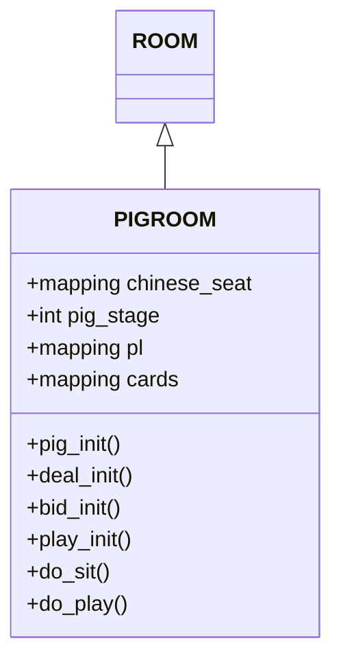
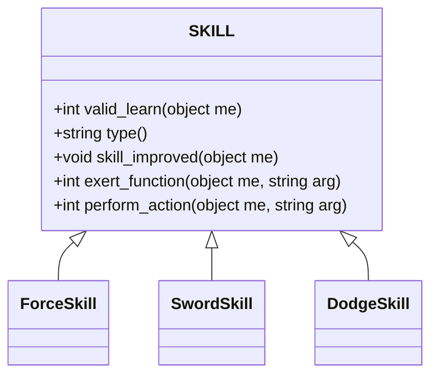

# 04 - 对象与继承体系

## 概述

本文档深入分析《侠客行》MUD的核心对象模型与继承体系。该MUD采用基于LPC语言的对象系统，融合了继承(Inheritance)与混入(Mixin/Feature)两种设计模式，构建了一个灵活且功能强大的游戏世界。

## LPC 对象模型基础

### 1. LPC 对象的基本概念

LPC (Lars Pensjö C) 是专门为MUD游戏设计的编程语言。在《侠客行》中，每个游戏实体都是一个对象，具有以下特性：

```lpc
// 对象三要素：
// 1. 程序(Program) - 定义对象行为的代码
// 2. 状态(State) - 存储在变量和映射中的数据
// 3. 引用(Reference) - 通过文件名或克隆引用对象
```

### 2. 继承 vs 混入机制

该MUD采用混合设计模式：

| 机制 | 关键字 | 用途 | 特性 |
|------|--------|------|------|
| 继承(Inheritance) | `inherit` | 定义对象的"是一个"关系 | 单继承为主，代码复用 |
| 混入(Feature) | `#include` + `inherit F_*` | 定义对象的"能做什么" | 多组合，功能模块 |

### 3. 核心设计思想

系统的核心设计哲学是：**继承构建骨架，特性提供功能**。即：
- `/inherit/` 目录下的文件定义对象的基本类型
- `/feature/` 目录下的文件提供可组合的功能模块
- `/std/` 或 `/clone/` 目录下的文件组装成完整对象

---

## /inherit/ 基类体系详解

### 1. 整体结构

基类体系按照功能分类组织在 `/inherit/` 目录下：

```
/inherit/
├── room/          # 房间基类
├── char/          # 角色基类
├── item/          # 物品基类
├── weapon/        # 武器基类
├── armor/         # 防具基类
├── skill/         # 技能基类
├── medicine/      # 药品基类
├── save/          # 数据保存基类
├── misc/          # 杂项基类
├── save.c         # 保存功能
└── sserver.c      # 服务器相关
```

### 2. 房间基类体系 (/inherit/room/)

#### 2.1 ROOM 基类 (room.c)

`ROOM` 是所有房间的基础，核心功能包括：

```lpc
// inherit/room/room.c
#pragma save_binary

#include <dbase.h>
#include <room.h>

inherit F_DBASE;      // 数据存储
inherit F_CLEAN_UP;   // 清理功能

// 主要功能：
static mapping doors;                         // 门系统
int query_max_encumbrance();                  // 最大负重
int usr_in();                                 // 检查是否有用户
object make_inventory(string file);           // 生成物品
void reset();                                 // 重置房间
string look_door(string dir);                 // 查看门
varargs int open_door(string dir, int from_other_side);  // 开门
varargs int close_door(string dir, int from_other_side); // 关门
int check_door(string dir, mapping door);     // 检查门
varargs void create_door(string dir, ...);    // 创建门
mapping query_doors();                        // 获取门映射
mixed query_door(string dir, string prop);    // 查询门属性
int valid_leave(object me, string dir);       // 验证离开
void setup();                                 // 设置房间
```

**设计要点**：
- 使用 `F_DBASE` 存储房间属性（描述、出口等）
- 实现完整的门系统，支持双向门状态同步
- `reset()` 函数负责刷新房间中的NPC和物品
- `make_inventory()` 辅助创建物品，包含特殊处理避免重复

#### 2.2 特殊房间类型

| 房间类型 | 文件 | 用途 |
|---------|------|------|
| 银行 | bank.c | 玩家存钱取钱 |
| 渡船 | ferry.c | 移动的交通工具 |
| 港口 | harbor.c | 渡口管理 |
| 当铺 | hockshop.c | 物品典当 |
| 拱猪房 | pigroom.c | 纸牌游戏房间 |
| 船只 | ship.c | 可航行的船只 |

#### 2.3 PIGROOM 拱猪房示例

`pigroom.c` 展示了如何扩展 `ROOM` 来实现复杂功能：



这是一个典型的游戏房间扩展，添加了游戏状态管理和玩家交互命令。

### 3. 角色基类体系 (/inherit/char/)

#### 3.1 CHARACTER 基类 (char.c)

`CHARACTER` 是所有生物的核心基类，这是一个极其重要的文件，它通过混合多个 feature 来构建完整角色功能：

```lpc
// inherit/char/char.c
#pragma save_binary

#include <action.h>
#include <ansi.h>
#include <command.h>
#include <condition.h>
#include <dbase.h>
#include <move.h>
#include <name.h>
#include <skill.h>
#include <team.h>
#include <user.h>

// 继承15个功能模块！
inherit F_ACTION;         // 动作系统
inherit F_ALIAS;          // 别名系统
inherit F_APPRENTICE;     // 师徒系统
inherit F_ATTACK;         // 战斗系统
inherit F_ATTRIBUTE;      // 属性系统
inherit F_COMMAND;        // 命令系统
inherit F_CONDITION;      // 状态系统
inherit F_DAMAGE;         // 伤害系统
inherit F_DBASE;          // 数据存储
inherit F_EDIT;           // 编辑功能
inherit F_FINANCE;        // 财务系统
inherit F_MARRY;          // 婚姻系统
inherit F_MESSAGE;        // 消息系统
inherit F_MORE;           // 分页显示
inherit F_MOVE;           // 移动系统
inherit F_NAME;           // 命名系统
inherit F_SKILL;          // 技能系统
inherit F_TEAM;           // 队伍系统
```

**核心心跳函数**：

```lpc
void heart_beat()
{
    int wimpy_ratio, cnd_flag;
    mapping my;
    object ob, rum_ob;

    my = query_entire_dbase();

    // 1. 清理命令计数
    if( userp(this_object()) ) {
        clear_cmd_count();
        // ... 频道消息处理
    }

    // 2. 检查内力精力上限
    if( my["neili"] > my["max_neili"]*2 )
        my["neili"] = my["max_neili"]*2;
    // ...

    // 3. 检查是否重伤死亡
    if( my["eff_qi"] < 0 || my["eff_jing"] < 0) {
        remove_all_enemy();
        die();
        return;
    }

    // 4. 检查是否昏迷
    if( my["qi"] < 0 || my["jing"] < 0 ... ) {
        if( living(this_object()) ) unconcious();
        else if( ... ) die();
        return;
    }

    // 5. 战斗处理
    if( is_busy() ) {
        continue_action();
        return;
    } else {
        // 逃跑检查
        if( is_fighting() && wimpy_ratio > 0 ... )
            GO_CMD->do_flee(this_object());
        attack();  // 进行攻击
    }

    // 6. NPC聊天
    if( !userp(this_object()) ) {
        this_object()->chat();
    }

    // 7. 状态更新
    if( tick-- == 0 ) {
        tick = 5 + random(10);
        cnd_flag = update_condition();
        
        // 8. 恢复处理
        if( (cnd_flag & CND_NO_HEAL_UP || !heal_up())
            && !is_fighting()
            && !interactive(this_object()) ) {
            // 和平状态下关闭心跳
            if( !ob ) set_heart_beat(0);
        }
    }

    // 9. 玩家年龄更新
    if( interactive(this_object()) )
        this_object()->update_age();
}
```

**CHARACTER 核心功能概览**：

| 功能模块 | 描述 | 相关函数 |
|---------|------|---------|
| 生命状态 | 管理气血、精神、内力 | `heart_beat()`, `die()`, `unconcious()` |
| 战斗系统 | 攻击、敌人管理 | `attack()`, `fight_ob()`, `kill_ob()` |
| 可见性 | 判断是否能看到目标 | `visible(object ob)` |

#### 3.2 NPC 基类 (npc.c)

`NPC` 继承 `CHARACTER`，添加NPC特有功能：

```lpc
// inherit/char/npc.c
inherit CHARACTER;
inherit F_CLEAN_UP;

// 核心功能
varargs object carry_object(string file, string alternative);  // 携带物品
object add_money(string type, int amount);                     // 生成金钱
int accept_fight(object who);                                  // 接受战斗
int accept_kill(object who);                                   // 接受杀戮
int return_home(object home);                                  // 返回出生点
int chat();                                                    // 聊天功能
int random_move();                                             // 随机移动
void cast_spell(string spell);                                 // 施法
int exert_function(string func);                               // 运用内功
int perform_action(string action);                             // 施展招式
```

**NPC聊天系统设计**：

```lpc
int chat()
{
    string *msg;
    int chance, rnd;

    // 检查环境
    if( !environment() || !living(this_object()) ) return 0;

    // 自动恢复
    if( query("neili") > 100 ) {
        // 恢复精力、气血等
    }

    // 随机触发聊天
    if( !chance = (int)query(is_fighting() ? "chat_chance_combat" : "chat_chance") )
        return 0;

    if( arrayp(msg = query(is_fighting() ? "chat_msg_combat" : "chat_msg")) ) {
        if( random(100) < chance && sizeof(msg) ) {
            rnd = random(sizeof(msg));
            if( stringp(msg[rnd]) )
                say(msg[rnd]);
            else if( functionp(msg[rnd]) )
                return evaluate(msg[rnd]);
        }
        return 1;
    }
}
```

**设计亮点**：
- 支持字符串消息和函数引用两种形式
- 区分普通聊天和战斗聊天
- 概率触发，更自然

#### 3.3 TRAINEE 受训者基类 (trainee.c)

`TRAINEE` 进一步扩展 `NPC`，用于可以驯服的生物：

```lpc
// inherit/char/trainee.c
inherit NPC;

// 核心功能
int is_trainee();                                   // 标识
int train_it(object me, object trainer, int pts);   // 训练过程
int do_gen(string arg);                             // 召唤跟随
int do_yao(string victim);                          // 攻击指令
int do_ting();                                      // 停止/待命
int do_stop();                                      // 停止攻击
int do_fang();                                      // 释放
void biting(object me, object ob);                  // 实际攻击
```

这展示了如何通过继承链逐步增强对象功能：
- `CHARACTER` → `NPC` → `TRAINEE`
- 每一层添加特定领域的功能

### 4. 物品基类体系 (/inherit/item/)

#### 4.1 ITEM 基类 (item.c)

所有物品的基础，简洁但重要：

```lpc
// inherit/item/item.c
#include <dbase.h>
#include <move.h>
#include <name.h>

inherit F_CLEAN_UP;  // 清理
inherit F_DBASE;     // 数据存储
inherit F_MOVE;      // 移动
inherit F_NAME;      // 命名
inherit F_CLONEABLE; // 可克隆

void setup()
{
    seteuid(getuid());
}
```

#### 4.2 COMBINED_ITEM 组合物品 (combined.c)

用于可堆叠物品（如金钱、药品）：

```lpc
// inherit/item/combined.c
static int amount;  // 数量

int query_amount();
void set_amount(int v);
void add_amount(int v);
string short();  // 显示如"三张三黄宝腊丹"
varargs int move(mixed dest, int silent);  // 移动时自动合并
```

**设计要点**：
- `set_weight(v * (int)query("base_weight"))` 动态计算总重
- `move()` 时自动查找同类物品合并，减少对象数量
- `short()` 显示中文数量+单位+名称

#### 4.3 MONEY 金钱 (money.c)

继承 `COMBINED_ITEM`，特殊的货币系统。

### 5. 武器基类体系 (/inherit/weapon/)

#### 5.1 武器基类结构

武器系统采用 "通用基类 + 具体类型" 的设计：

```
/inherit/weapon/
├── _axe.c       # 斧类基础
├── axe.c        # 斧类实现
├── _blade.c     # 刀类基础
├── blade.c      # 刀类实现
├── _sword.c     # 剑类基础
├── sword.c      # 剑类实现
├── bow.c        # 弓箭（特殊实现）
├── _heavy.c     # 重型武器
├── throwing.c   # 投掷武器
└── ...其他武器类型
```

#### 5.2 SWORD 剑类示例

```lpc
// inherit/weapon/sword.c
#include <ansi.h>
#include <weapon.h>

#ifdef AS_FEATURE
#include <dbase.h>
#else
inherit EQUIP;
#endif

varargs void init_sword(int damage, int flag)
{
    if( clonep(this_object()) ) return;

    set("weapon_prop/damage", damage);
    set("flag", (int)flag | EDGED);
    set("skill_type", "sword");
    if( !query("actions") ) {
        set("actions", (: call_other, WEAPON_D, "query_action" :) );
        set("verbs", ({ "slash", "slice", "thrust" }) );
    }
}

// 特殊攻击效果：破坏防具
mixed hit_ob(object me, object victim, int damage_bonus, int factor)
{
    // 检查是否能划破对方衣服
    if (victim->query_temp("armor/cloth") 
        && random(weapon->query("weapon_prop/damage")) >= 10) {
        
        // 降低防具防护力，添加破损描述
        ob->add("armor_prop/armor", -1);
        ob->add("wreckage", 1);
        
        // 根据破损程度改变描述
        if ( j < k/4 || j < 1 ) {
            ob->set("long", "一件残破不堪的"+ob->query("name")+"\n");
            // ...
        }
        
        return HIW"只听见「嗤」地一声，$n身上的"+ob->query("name")+HIW+"被划开一道口子。\n"NOR;
    }
}
```

**武器系统设计亮点**：
- 支持武器类型标识（`flag`）：`EDGED`（锋利）、`TWO_HANDED`（双手）等
- 武器动作动态调用 `WEAPON_D` 获取
- 每个武器类型可有自定义 `hit_ob()` 实现特殊效果

**武器标志位定义**（推测）：

```c
// 从代码推测的 weapon.h 内容
#define EDGED        0x01    // 锋利兵器，可划破衣物
#define TWO_HANDED   0x02    // 需双手使用
#define SECONDARY    0x04    // 可作为副武器
#define SELF_ACTION  0x08    // 使用自己定义的动作
```

### 6. 防具基类体系 (/inherit/armor/)

#### 6.1 防具类型结构

```
/inherit/armor/
├── armor.c      # 基础防具
├── cloth.c      # 衣服
├── boots.c      # 靴子
├── head.c       # 头盔
├── neck.c       # 项链
├── hands.c      # 手套
├── finger.c     # 戒指
├── shield.c     # 盾牌
├── surcoat.c    # 披风
└── wrists.c     # 护腕
```

#### 6.2 防具装备机制

防具通过 `F_EQUIP` 功能实现穿戴，详见后续 feature 分析。

### 7. 技能基类体系 (/inherit/skill/)

#### 7.1 SKILL 基类 (skill.c)

技能基类是所有技能的标准框架：

```lpc
// inherit/skill/skill.c
inherit F_CLEAN_UP;
#include <ansi.h>

// 核心接口
int valid_learn(object me);                // 验证能否学习
int valid_effect(...);                     // 验证效果
string type();                             // 技能类型
void skill_improved(object me);            // 升级回调
int exert_function(object me, string arg); // 内功运用
int perform_action(object me, string arg); // 招式施展
int cast_spell(...);                       // 施法
int conjure_magic(...);                    // 法术
int scribe_spell(...);                     // 抄录卷轴
mixed hit_ob(...);                         // 攻击效果
```

**技能系统设计**：



**关键机制**：
- `type()` 返回 "martial"（武术）或 "knowledge"（学识）
- `exert_function_file(func)` 动态返回功能文件路径
- `perform_action_file(action)` 动态返回招式文件路径
- `skill_improved()` 升级时的特殊效果（如加属性）

#### 7.2 FORCE 内功基类 (force.c)

内功的特殊基类，处理内力相关功能。

### 8. 数据保存基类 (/inherit/save/)

#### 8.1 DATA 数据保存 (data.c)

提供数据存储路径相关的辅助函数：

```lpc
// inherit/save/data.c
varargs string extract(string str, int from, int to);
string data_dir(object obj);
string data_file(object obj);
varargs string user_data_dir(object obj, string name);
varargs string user_data_file(object obj, string name);
void assure_user_save_dir(object user);
void assure_save_dir(object user);
```

这主要是工具函数集，帮助其他对象构建正确的数据保存路径。

---

## /feature/ 特性体系详解

特性（Feature）是这个MUD最精妙的设计之一。它们是可复用的功能模块，通过 `inherit` 混入对象。

### 1. 特性体系结构

```
/feature/
├── dbase.c         # 数据存储系统
├── move.c          # 移动系统
├── name.c          # 命名系统
├── message.c       # 消息系统
├── command.c       # 命令系统
├── attack.c        # 战斗攻击
├── damage.c        # 伤害处理
├── skill.c         # 技能系统
├── condition.c     # 状态系统
├── attribute.c     # 属性系统
├── equip.c         # 装备系统
├── autoload.c      # 自动加载
├── save.c          # 对象保存
├── finance.c       # 财务系统
├── multi.c         # 多部件对象
├── action.c        # 动作系统
├── alias.c         # 别名系统
├── apprentice.c    # 师徒系统
├── clean_up.c      # 清理功能
├── cloneable.c     # 可克隆
├── edit.c          # 编辑功能
├── food.c          # 食物系统
├── liquid.c        # 液体系统
├── marry.c         # 婚姻系统
├── more.c          # 分页显示
├── pill.c          # 丹药系统
├── sadjust.c       # 等级调整
├── sserver.c       # 服务器功能
├── team.c          # 队伍系统
├── treemap.c       # 树状映射
├── unique.c        # 唯一对象
├── vendor.c        # 商人系统
└── ...更多特性
```

### 2. F_DBASE 数据存储系统 (dbase.c)

这是最基础、最重要的特性，几乎所有对象都会继承。

#### 2.1 核心数据结构

```lpc
// feature/dbase.c
inherit F_TREEMAP;

mapping dbase;        // 持久化数据映射
static mapping tmp_dbase;  // 临时数据映射
static mixed default_ob;   // 默认对象（原型）
```

#### 2.2 数据访问 API

```lpc
// 持久化数据操作
mixed set(string prop, mixed data);            // 设置属性
varargs mixed query(string prop, int raw);     // 获取属性
mixed add(string prop, mixed data);            // 增加数值
int delete(string prop);                       // 删除属性
mapping query_entire_dbase();                  // 获取全部数据

// 临时数据操作（不保存）
mixed set_temp(string prop, mixed data);
varargs mixed query_temp(string prop, int raw);
mixed add_temp(string prop, mixed data);
int delete_temp(string prop);
mapping query_entire_temp_dbase();

// 原型对象
mixed query_default_object();
void set_default_object(mixed ob);
```

#### 2.3 路径访问机制

`F_DBASE` 支持类似文件路径的层级访问：

```lpc
// 例如：
set("family/family_name", "少林派");
set("family/master_name", "玄慈方丈");
set("family/generation", 36);

// 相当于：
// dbase["family"] = ([
//     "family_name": "少林派",
//     "master_name": "玄慈方丈",
//     "generation": 36
// ]);
```

内部通过 `_set()`, `_query()`, `_delete()` 配合 `F_TREEMAP` 实现。

#### 2.4 函数值延迟评估

`query()` 支持函数类型值，调用时动态计算：

```lpc
// 设置时保存函数引用
set("short", (: short :));

// 查询时自动 evaluate
// 如果不是 raw 模式，会自动调用函数
// 即：evaluate(data, this_object())
```

#### 2.5 默认对象机制

```lpc
void set_default_object(mixed ob)
{
    if( !geteuid() ) seteuid(getuid());
    default_ob = ob;
    ob->add("no_clean_up", 1);
}

mixed query(string prop, int raw)
{
    // 先查自己的 dbase
    // 没有就查 default_ob
    if( undefinedp(data) && default_ob )
        data = default_ob->query(prop, 1);
    
    // 最后可能 evaluate
}
```

这实现了原型模式，多个对象可共享同一个默认对象的数据。

### 3. F_MOVE 移动系统 (move.c)

#### 3.1 核心概念

```lpc
// feature/move.c
static int weight = 0;          // 自身重量
static int encumb = 0, max_encumb = 0;  // 负重、最大负重
```

#### 3.2 负重计算

```lpc
nomask int query_encumbrance();        // 当前负重
nomask int over_encumbranced();        // 是否超重
nomask int query_max_encumbrance();    // 最大负重
nomask void set_max_encumbrance(int e);
nomask void add_encumbrance(int w);    // 增加负重
nomask int query_weight();              // 自身重量
nomask void set_weight(int w);
nomask int weight();                   // 总重量 = 自身 + 负重
```

**传递链设计**：
- 物品被移动时，调用 `env->add_encumbrance(w)`
- 容器物品的重量 = 自重 + 内容物总重
- 递归传递，形成负重链

#### 3.3 移动操作

```lpc
varargs int move(mixed dest, int silently)
{
    object ob, env;
    
    // 1. 如果装备中，先卸下
    if( query("equipped") && !this_object()->unequip() )
        return notify_fail("你没有办法取下这样东西。\n");
    
    // 2. 获取目标对象
    if( objectp(dest) ) ob = dest;
    else if( stringp(dest) ) {
        call_other(dest, "???");  // 加载对象
        ob = find_object(dest);
    }
    
    // 3. 负重检查（如果不是放入自己内部）
    if( !env && (int)ob->query_encumbrance() + weight()
        > (int)ob->query_max_encumbrance() ) {
        // 超重失败
    }
    
    // 4. 执行移动
    if( environment() ) environment()->add_encumbrance( - weight());
    ob->add_encumbrance(weight());
    move_object(ob);  // 驱动内置 move_object()
    
    // 5. 玩家自动 look
    if( interactive(this_object()) && living(this_object()) && !silently ) {
        command("look");
    }
    
    return 1;
}
```

#### 3.4 析构处理

```lpc
void remove(string euid)
{
    // 验证调用者
    if( !previous_object() || ... )
        error(...);
    
    // 处理玩家析构
    if( userp(this_object()) && euid != ROOT_UID ) { ... }
    
    // 自动卸下装备
    else if( this_object()->query("equipped") ) {
        if( !this_object()->unequip() )
            log_file("destruct", ...);
    }
    
    // 从环境中减去重量
    if( environment() ) environment()->add_encumbrance( - weight );
    
    // 减少默认对象的计数
    if( default_ob = this_object()->query_default_object() )
        default_ob->add("no_clean_up", -1);
}
```

### 4. F_NAME 命名系统 (name.c)

处理对象的名称、标识、描述等。

#### 4.1 核心数据

```lpc
// feature/name.c
static string *my_id;  // 标识符列表
```

#### 4.2 名称设置

```lpc
void set_name(string name, string *id)
{
    set("name", name);
    set("id", id[0]);  // 第一个 ID 作为主标识
    my_id = id;        // 全部 ID 存入静态变量
}

void set_color(string color)
{
    // 设置带颜色的名称
    string colorname = color + query("name");
    // ... 替换颜色标记
    set("colorname", colorname + NOR);
}
```

#### 4.3 识别判断

```lpc
int id(string str)
{
    string *applied_id;
    
    // 看不见就无法识别
    if( this_player() && !this_player()->visible(this_object()) )
        return 0;
    
    // 临时伪装的 ID 优先
    if( pointerp(applied_id = query_temp("apply/id")) && sizeof(applied_id) )
        return member_array(str, applied_id) != -1;
    
    // 普通 ID 匹配
    if( pointerp(my_id) && member_array(str, my_id) != -1 )
        return 1;
    
    return 0;
}
```

#### 4.4 名称显示

```lpc
varargs string name(int raw)
{
    string str, *mask;
    
    // 临时伪装的名称优先
    if( !raw && sizeof(mask = query_temp("apply/name")) )
        return mask[sizeof(mask)-1];
    
    // 普通名称
    if( stringp(str = query("name")) ) return str;
    
    // 默认用文件名
    return file_name(this_object());
}

varargs string short(int raw)
{
    string naming, title, nick, str;
    
    // 颜色名称优先
    if( !stringp(naming = query("colorname")) )
        naming = name(raw);
    
    // 有自定义 short 就用
    if( !stringp(str = query("short")) )
        str = sprintf("%s(%s)", naming, capitalize(query("id")));
    
    // 非角色到此为止
    if( !this_object()->is_character() ) return str;
    
    // 角色添加称号、绰号、状态
    if( !raw ) {
        // 检查是否在修炼
        if( query_temp("pending/exercise") )
            return name() + "正坐在地下修炼内力。";
        // ...
    }
    
    // 伪装名称
    if( !raw && sizeof(mask = query_temp("apply/short")) )
        str = mask[sizeof(mask)-1];
    else {
        if( stringp(nick = query("nickname")) )
            str = sprintf("「%s」%s", nick, str);
        if( stringp(title = query("title")) )
            str = sprintf("%s%s%s", title, nick?"":" ", str);
    }
    
    // 状态标记
    if( !raw ) {
        if( this_object()->is_ghost() ) str = HIB "(鬼气) " NOR + str;
        if( query_temp("netdead") ) str += HIG " <断线中>" NOR;
        if( in_input() ) str += HIC " <输入文字中>" NOR;
        if( in_edit() ) str += HIY " <编辑档案中>" NOR;
        if( interactive(...) && query_idle(...) > 120 )
            str += HIM " <发呆中>" NOR;
        if( !living(this_object()) )
            str += HIR + query("disable_type") + NOR;
    }
    
    return str;
}

varargs string long(int raw)
{
    string str, extra, *mask;
    
    // 伪装描述优先
    if( !raw && sizeof(mask = query_temp("apply/long")) )
        str = mask[sizeof(mask)-1];
    else if( !stringp(str = query("long")) )
        str = short(raw) + "。\n";
    
    // 额外描述
    if( stringp(extra = this_object()->extra_long()) )
        str += extra;
    
    return str;
}
```

**名称系统设计亮点**：
- 支持多重 ID，可通过多个名称识别同一对象
- 支持临时伪装（`apply/id`, `apply/name`, `apply/short`, `apply/long`）
- `short()` 显示丰富的状态信息
- 支持 ANSI 颜色

### 5. F_ATTACK 战斗攻击系统 (attack.c)

#### 5.1 敌人管理

```lpc
// feature/attack.c
static object *enemy = ({});     // 敌人列表
static string *killer = ({});    // 杀戮目标

object *query_enemy();
string *query_killer();

// 检查战斗状态
varargs int is_fighting(object ob);
varargs int is_killing(string id);

// 开始战斗/杀戮
void fight_ob(object ob);
void kill_ob(object ob);

// 停止战斗/杀戮
int remove_enemy(object ob);
int remove_killer(object ob);
void remove_all_enemy();
void remove_all_killer();

// 清理无效敌人
void clean_up_enemy();
```

**设计要点**：
- `enemy` 是战斗对象列表，`killer` 是要杀的ID列表
- 杀死目标需要先在 `killer` 列表中
- `clean_up_enemy()` 清理不在同一环境、已死亡的敌人

#### 5.2 攻击选择

```lpc
object select_opponent()
{
    int which;
    
    if( !sizeof(enemy) ) return 0;
    
    which = random(MAX_OPPONENT);  // MAX_OPPONENT = 4
    
    return which < sizeof(enemy) ? enemy[which] : enemy[0];
}
```

随机选择，最多4个敌人。

#### 5.3 攻击执行

```lpc
int attack()
{
    object opponent;
    
    clean_up_enemy();
    
    opponent = select_opponent();
    if( objectp(opponent) ) {
        set_temp("last_opponent", opponent);
        
        // 检查是否投降
        if( this_object()->query_temp("yield") )
            return 1;
        
        // 特殊战斗模式
        if( !special_attack(opponent) )
            COMBAT_D->fight(this_object(), opponent);
        
        return 1;
    }
    return 0;
}
```

实际攻击委托给 `COMBAT_D`（战斗守护进程）处理。

#### 5.4 特殊战斗系统

```lpc
int special_attack(object opponent)
{
    if( (this_object()->query_temp("stand/anubis"))
        || (opponent->query_temp("stand/anubis")) ) {
        S_COMBAT_D->fight(this_object(), opponent);
        return 1;
    }
    return 0;
}
```

支持扩展的特殊战斗模式，如"阿努比斯模式"。

#### 5.5 初始化交互

```lpc
void init()
{
    object ob;
    string vendetta_mark;
    
    // 正在战斗或不能战斗，返回
    if( is_fighting() || !living(this_object()) ... )
        return;
    
    // 自动攻击有杀心的玩家
    if( userp(ob = this_player()) && is_killing(ob->query("id")) ) {
        COMBAT_D->auto_fight(this_object(), ob, "hatred");
        return;
    }
    
    // 血仇标记
    else if( stringp(vendetta_mark = query("vendetta_mark"))
        && ob->query("vendetta/" + vendetta_mark) ) {
        COMBAT_D->auto_fight(this_object(), ob, "vendetta");
        return;
    }
    
    // 好战态度
    else if( userp(ob) && (string)query("attitude") == "aggressive" ) {
        COMBAT_D->auto_fight(this_object(), ob, "aggressive");
        return;
    }
}
```

### 6. F_DAMAGE 伤害与死亡系统 (damage.c)

这是最复杂的特性之一，处理受伤、治疗、昏迷、死亡等。

#### 6.1 核心标志

```lpc
int ghost = 0;  // 是否是鬼魂状态
int is_ghost() { return ghost; }
```

#### 6.2 伤害接收

```lpc
varargs int receive_damage(string type, int damage, mixed who)
{
    int val;
    
    // 类型检查："jing"（精神）、"qi"（气血）、"jingli"（精力）
    if( type != "jing" && type != "qi" && type != "jingli" )
        error(...);
    
    // 记录攻击者
    set_temp("last_damage_from", who);
    if( living(this_object()) && objectp(who) && userp(who) )
        set_temp("last_eff_damage_from", who->query("id"));
    
    // 扣除数值
    val = (int)query(type) - damage;
    if( val >= 0 ) set(type, val);
    else set(type, -1);
    
    set_heart_beat(1);
    return damage;
}

varargs int receive_wound(string type, int damage, mixed who)
{
    // 类似，但伤的是 "eff_qi"（有效气血）或 "eff_jing"（有效精神）
    // 这是更严重的伤害，影响最大值
}
```

#### 6.3 治疗恢复

```lpc
int receive_heal(string type, int heal)
{
    // 恢复当前值，不超过有效最大值
}

int receive_curing(string type, int heal)
{
    // 恢复有效最大值
}
```

#### 6.4 昏迷 (unconcious)

```lpc
void unconcious()
{
    object defeater;
    
    if( !living(this_object()) ) return;
    if( wizardp(this_object()) && query("env/immortal") ) return;
    
    // 胜利者奖励
    if( objectp(defeater = query_temp("last_damage_from")) ) {
        COMBAT_D->winner_reward(defeater, this_object);
    }
    
    // 清除敌人
    this_object()->remove_all_enemy();
    // 打断打坐等
    this_object()->interrupt_me();
    // 解散队伍
    this_object()->dismiss_team();
    
    // 通知
    message("system", HIR "\n你的眼前一黑，接著什么也不知道了。\n\n" NOR,
        this_object());
    
    // 标记昏迷
    this_object()->disable_player(" <昏迷不醒>");
    
    // 清零属性
    set("jing", 0);
    set("qi", 0);
    set("jingli", 0);
    set_temp("block_msg/all", 1);
    
    // 公告
    COMBAT_D->announce(this_object(), "unconcious");
    
    // 定时苏醒
    call_out("revive", random(100 - query("con")) + 30);
}

varargs void revive(int quiet)
{
    // 恢复工作
    // 如果还在别人物品里，移出来
    while( environment()->is_character() )
        this_object()->move(environment(environment()));
    
    this_object()->enable_player();
    if( !quiet ) {
        COMBAT_D->announce(this_object(), "revive");
        set_temp("block_msg/all", 0);
        message("system", HIY "\n慢慢地你终于又有了知觉。\n\n" NOR,
            this_object());
    } else
        set_temp("block_msg/all", 0);
}
```

#### 6.5 死亡 (die)

```lpc
void die()
{
    object corpse, rum_ob, me;
    mixed killer;
    
    me = this_object();
    
    // 不死房间处理
    if( environment()->query("no_death") && userp(this_object()) ) {
        unconcious();
        remove_call_out("revive");
        return;
    }
    
    // 复活的巫师
    if( !living(this_object()) ) revive(1);
    if( wizardp(this_object()) && query("env/immortal") ) return;
    
    // 清除状态
    this_object()->clear_condition();
    this_object()->delete("poisoner");
    
    // 公告死亡
    COMBAT_D->announce(this_object(), "dead");
    
    // 死亡惩罚
    if( userp(this_object()) && !environment()->query("no_death") )
        COMBAT_D->death_penalty(this_object());
    
    // 记录杀手
    if( objectp(killer = query_temp("last_damage_from")) ) {
        set_temp("my_killer", killer->query("id"));
        COMBAT_D->killer_reward(killer, this_object);
    }
    else if( userp(this_object()) ) {
        // 流言蜚语
        // ...
    }
    
    // 记录PK日志
    if( userp(this_object()) ) {
        if( stringp(query_temp("last_eff_damage_from")) ) {
            log_file("PKILL_DATA", ...);
            log_file("PLAYER_DEATH", ...);
        }
        // ...
    }
    
    // 生成尸体
    if( (!environment()->query("no_death") || !userp(this_object()))
        && objectp(corpse = CHAR_D->make_corpse(this_object(), killer)) )
        corpse->move(environment());
    
    // 清除所有敌人
    this_object()->remove_all_killer();
    all_inventory(environment())->remove_killer(this_object());
    
    if( userp(this_object()) ) {
        // 打断忙状态
        if( this_object()->is_busy() )
            this_object()->interrupt_me();
        
        // 保留1点生命
        set("jing", 1); set("eff_jing", 1);
        set("qi", 1); set("eff_qi", 1);
        set("jingli", 1);
        
        // 不死房间特殊处理
        if( environment()->query("no_death") ) {
            set("eff_jing", query("max_jing"));
            set("eff_qi", query("max_qi"));
            return;
        }
        
        // 解散队伍
        this_object()->dismiss_team();
        // 保存
        this_object()->save();
        // 变成鬼魂
        ghost = 1;
        // 移动到死亡空间
        this_object()->move(DEATH_ROOM);
        // 开始死亡处理
        DEATH_ROOM->start_death(this_object());
        // 离婚
        MARRY_D->break_marriage(this_object());
        // 特殊师徒关系处理
        if( ... ) CHAR_D->break_relation(this_object());
    }
    else {
        // NPC直接销毁
        destruct(this_object());
    }
}
```

#### 6.6 恢复 (heal_up)

```lpc
int heal_up()
{
    int update_flag, i;
    mapping my;
    
    update_flag = 0;
    my = query_entire_dbase();
    
    // 消耗食物水分
    if( my["water"] > 0 ) { my["water"] -= 1; update_flag++; }
    if( my["food"] > 0 ) { my["food"] -= 1; update_flag++; }
    
    // 没有食物水分无法恢复
    if( my["water"] < 1 && userp(this_object()) ) return update_flag;
    if( my["food"] < 1 && userp(this_object()) ) return update_flag;
    
    // 恢复精神
    if( this_object()->is_fighting() )
        my["jing"] += my["con"] / 9 + my["max_jingli"] / 30;
    else
        my["jing"] += my["con"] / 3 + my["max_jingli"] / 10;
    
    if( my["jing"] >= my["eff_jing"] ) {
        my["jing"] = my["eff_jing"];
        // 恢复有效精神上限
        if( my["eff_jing"] < my["max_jing"] ) {
            my["eff_jing"] ++;
            update_flag++;
        }
    }
    else update_flag++;
    
    // 恢复气血（类似）
    // ...
    
    // 恢复精力
    if( my["max_jingli"] && my["jingli"] < my["max_jingli"] ) {
        // ...
        update_flag++;
    }
    
    // 恢复内力
    if( my["max_neili"] && my["neili"] < my["max_neili"] ) {
        if( this_object()->is_fighting() )
            my["neili"] += (int)this_object()->query_skill("force", 1) / 6;
        else
            my["neili"] += (int)this_object()->query_skill("force", 1) / 2;
        // ...
        update_flag++;
    }
    
    return update_flag;
}
```

**恢复系统设计要点**：
- 战斗时恢复速度慢，和平时期快
- 需要消耗食物和水
- 先恢复当前值，满了再恢复有效最大值
- 内力恢复速度取决于内功等级

### 7. F_SKILL 技能系统 (skill.c)

#### 7.1 技能数据结构

```lpc
mapping skills;       // 技能等级 ([skill_name: level])
mapping learned;      // 学习进度 ([skill_name: points])
mapping skill_map;    // 技能映射 ([skill_name: mapped_to])
mapping skill_prepare; // 准备技能
```

#### 7.2 技能操作

```lpc
// 设置/删除技能
void set_skill(string skill, int val);
int delete_skill(string skill);

// 技能映射
varargs void map_skill(string skill, string mapped_to);
string query_skill_mapped(string skill);

// 技能准备
varargs void prepare_skill(string skill, string prepared_to);
string query_skill_prepared(string skill);

// 查询技能等级
varargs int query_skill(string skill, int raw);
```

#### 7.3 技能映射机制

```lpc
varargs int query_skill(string skill, int raw)
{
    if( !raw ) {
        int s;
        // 临时加成
        s = query_temp("apply/" + skill);
        if( mapp(skills) ) {
            // 基础值的一半
            s += skills[skill] / 2;
            // 映射技能加成
            if( mapp(skill_map) )
                s += skills[skill_map[skill]];
        }
        return s;
    }
    // raw = 1，只返回原始值
    if( mapp(skills) && !undefinedp(skills[skill]) ) return skills[skill];
    return 0;
}
```

**映射设计示例**：
```lpc
// 玩家学习了基本剑法（100级）和辟邪剑谱（1级）
set_skill("sword", 100);        // 基本剑法
set_skill("pixie-jian", 1);     // 辟邪剑谱

// 映射辟邪剑谱到剑法
map_skill("sword", "pixie-jian");

// 实际等级计算
// query_skill("sword") = 100/2 + 1 = 51
// 使用辟邪剑谱的特殊效果，但等级综合计算
```

#### 7.4 技能学习

```lpc
varargs void improve_skill(string skill, int amount, int weak_mode)
{
    int spi;
    
    if( !userp(this_object()) ) return;
    
    // 验证技能存在
    if( !find_object(SKILL_D(skill)) && file_size(SKILL_D(skill)+".c") < 0 )
        error(...);
    
    if( !weak_mode || !userp(this_object()) ) {
        if( !mapp(skills) ) skills = ([]);
        if( undefinedp(skills[skill]) ) skills[skill] = 0;
    }
    
    // 学习惩罚：技能越多，效率越低
    spi = 30;  // 最大30个技能无惩罚
    if( sizeof(learned) > spi )
        amount /= sizeof(learned) - spi;
    if( !amount ) amount = 1;
    
    // 增加学习进度
    if( !mapp(learned) ) learned = ([ skill: amount ]);
    else (int)learned[skill] += amount;
    
    // 检查是否升级
    if( (!weak_mode || !userp(this_object()))
        && learned[skill] > (skills[skill] + 1) * (skills[skill] + 1) ) {
        skills[skill] ++;
        learned[skill] = 0;
        tell_object(this_object(), HIC "你的「" + to_chinese(skill) + "」进步了！\n" NOR);
        SKILL_D(skill)->skill_improved(this_object);
    }
}
```

**学习设计要点**：
- 升级公式：`learned > (level+1)^2`
- 技能越多，新技能学习越慢
- 升级时调用 `skill_improved()` 回调

#### 7.5 死亡惩罚

```lpc
int skill_death_penalty()
{
    string *sk;
    int i;
    
    if( wizardp(this_object()) || !mapp(skills) ) return 0;
    
    sk = keys(skills);
    if( !mapp(learned) ) {
        // 没有学习记录，只降低技能等级
        for(i = 0; i < sizeof(sk); i++) {
            skills[sk[i]]--;
            if( skills[sk[i]] < 0 ) map_delete(skills, sk[i]);
            else learned = ([sk[i]: (skills[sk[i]]+1) * (skills[sk[i]]+1) / 2]);
        }
    }
    else {
        // 有学习记录，先降低学习进度
        for(i = 0; i < sizeof(sk); i++) {
            if( (int)learned[sk[i]] > (skills[sk[i]]+1) * (skills[sk[i]]+1) / 2 )
                learned[sk[i]] -= (skills[sk[i]]+1) * (skills[sk[i]]+1) / 2;
            else {
                skills[sk[i]]--;
                if( skills[sk[i]] < 0 ) map_delete(skills, sk[i]);
                else learned[sk[i]] += (skills[sk[i]]+1) * (skills[sk[i]]+1) / 2;
            }
        }
    }
    skill_map = 0;  // 清除映射
    return 1;
}
```

### 8. F_COMMAND 命令系统 (command.c)

#### 8.1 命令路径

```lpc
static string *path;  // 命令搜索路径
```

#### 8.2 核心命令钩子

```lpc
nomask int command_hook(string arg)
{
    string verb, file;
    
    verb = query_verb();
    if( (verb = remove_leading_space(verb)) == "" ) return 0;
    
    // 1. 检查是否是移动方向（如east）
    if( !arg && (environment() && stringp(environment()->query("exits/" + verb)))
        && stringp(file = find_command("go"))
        && call_other(file, "main", this_object(), verb) ) {
        // ...
    }
    
    // 2. 查找普通命令
    else if( stringp(file = find_command(verb))
        && call_other(file, "main", this_object(), arg) ) {
        // ...
    }
    
    // 3. 表情动作
    else if( EMOTE_D->do_emote(this_object(), verb, arg) ) {
        // ...
    }
    
    // 4. 频道聊天
    else if( CHANNEL_D->do_channel(this_object(), verb, arg) ) {
        // ...
    }
    
    else return 0;
    return 1;
}
```

#### 8.3 玩家启用/禁用

```lpc
nomask void enable_player()
{
    // 设置 living_name
    if( stringp(query("id")) ) set_living_name(query("id"));
    else set_living_name(query("name"));
    
    // 启用命令
    delete_temp("disabled");
    enable_commands();
    add_action("command_hook", "", 1);  // 捕获所有命令
    
    // 设置命令路径
    if( !userp(this_object()) )
        set_path(NPC_PATH);
    else if( this_object()->query("registered") == 0 )
        set_path(UNR_PATH);
    else
        switch( wizhood(this_object()) ) {
            case "(admin)":     set_path(ADM_PATH);   enable_wizard(); break;
            case "(arch)":      set_path(ARC_PATH);   enable_wizard(); break;
            case "(wizard)":    set_path(WIZ_PATH);   enable_wizard(); break;
            // ... 更多特权等级
            default:            set_path(PLR_PATH);
        }
}

nomask void disable_player(string type)
{
    set("disable_type", type);
    set_temp("disabled", 1);
    disable_commands();
    enable_commands();  // 立即重新启用，但 alias 会阻塞
}
```

**命令系统设计亮点**：
- 单一 `command_hook` 处理所有输入
- 优先级：移动 > 普通命令 > 表情 > 频道
- 根据身份设置不同命令路径
- `disable_player()` 不是真的禁用命令，而是通过别名阻塞

### 9. F_MESSAGE 消息系统 (message.c)

#### 9.1 消息缓冲

```lpc
static string *msg_buffer = ({});  // 输入时暂存消息
#define MAX_MSG_BUFFER 500
```

#### 9.2 消息接收

```lpc
void receive_message(string msgclass, string msg)
{
    string subclass, *ch;
    
    // NPC 转播消息
    if( !interactive(this_object()) ) {
        this_object()->relay_message(msgclass, msg);
        return;
    }
    
    // 处理子类
    if( sscanf(msgclass, "%s:%s", subclass, msgclass) == 2 ) {
        switch(subclass) {
            case "channel":  // 频道消息
                if( !pointerp(ch = query("channels"))
                    || member_array(msgclass, ch) == -1 )
                    return;  // 不在此频道，不接收
                break;
            case "outdoor":  // 户外消息
                if( !environment() || !environment()->query("outdoors") )
                    return;
                break;
            case "weather":  // 天气消息
                if( !environment() || !environment()->query("weather") )
                    return;
                break;
            default:
                error(...);
        }
    }
    
    // 消息阻塞检查
    if( query_temp("block_msg/all") || query_temp("block_msg/" + msgclass) )
        return;
    
    // 失明检查
    if( objectp(this_object()) && userp(this_object()) && living(this_object()) )
        if( random(this_object()->query_condition("blind") * 2) > 0 )
            return;
    
    // 编码转换（GB -> Big5）
    if( objectp(this_object()) && this_object()->query("language") == "BIG5" )
        msg = "/adm/daemons/languaged"->toBig5(msg);
    
    // 正在输入/编辑，先暂存
    if( in_input(this_object()) || in_edit(this_object()) ) {
        if( sizeof(msg_buffer) < MAX_MSG_BUFFER )
            msg_buffer += ({ msg });
    }
    else
        receive(msg);  // 直接发送
}
```

#### 9.3 提示写出

```lpc
void write_prompt()
{
    if( sizeof(msg_buffer) ) {
        receive(BOLD "[输入时暂存讯息]\n" NOR);
        for(int i = 0; i < sizeof(msg_buffer); i++)
            receive(msg_buffer[i]);
        msg_buffer = ({});
    }
    write("> ");
}
```

### 10. F_EQUIP 装备系统 (equip.c)

#### 10.1 穿戴防具

```lpc
int wear()
{
    object owner;
    mapping armor_prop, applied_prop;
    string *apply, type;
    
    // 检查环境是否是角色
    if( !(owner = environment())->is_character() ) return 0;
    
    // 已装备的直接成功
    if( query("equipped") ) return 1;
    
    // 检查是否有 armor_prop
    armor_prop = query("armor_prop");
    if( !query("armor_prop/armor") )
        return notify_fail("你只能穿戴可当作护具的东西。\n");
    
    // 检查是否已穿戴同类防具
    type = query("armor_type");
    if( owner->query_temp("armor/" + type) )
        return notify_fail("你已经穿戴了同类型的护具了。\n");
    
    // 标记为已装备
    owner->set_temp("armor/" + type, this_object());
    
    // 应用属性加成
    apply = keys(armor_prop);
    applied_prop = owner->query_temp("apply");
    if( !mapp(applied_prop) ) applied_prop = ([]);
    for(int i = 0; i < sizeof(apply); i++)
        if( undefinedp(applied_prop[apply[i]]) )
            applied_prop[apply[i]] = armor_prop[apply[i]];
        else
            applied_prop[apply[i]] += armor_prop[apply[i]];
    owner->set_temp("apply", applied_prop);
    
    set("equipped", "worn");
    return 1;
}
```

#### 10.2 装备武器

```lpc
int wield()
{
    object owner, old_weapon;
    mapping weapon_prop;
    string *apply, type;
    int flag;
    
    if( !(owner = environment())->is_character() ) return 0;
    if( query("equipped") ) return 1;
    
    if( !mapp(weapon_prop = query("weapon_prop")) )
        return notify_fail("你只能装备可当作武器的东西。\n");
    
    flag = query("flag");
    
    // 双手武器检查
    if( flag & TWO_HANDED ) {
        if( owner->query_temp("weapon")
            || owner->query_temp("secondary_weapon")
            || owner->query_temp("armor/shield") )
            return notify_fail("你必须空出双手才能装备双手武器。\n");
        owner->set_temp("weapon", this_object());
    }
    else {
        if( !(old_weapon = owner->query_temp("weapon")) )
            owner->set_temp("weapon", this_object());
        else if( !owner->query_temp("secondary_weapon")
            && !owner->query_temp("armor/shield") ) {
            // 副手空着
            if( flag & SECONDARY ) {
                // 可作为副手武器
                owner->set_temp("secondary_weapon", this_object);
            }
            else if( (int)old_weapon->query("flag") & SECONDARY ) {
                // 原来的是副手武器，交换
                old_weapon->unequip();
                owner->set_temp("weapon", this_object());
                old_weapon->wield();
            }
            else
                return notify_fail("你必须先放下你目前装备的武器。\n");
        }
        else
            return notify_fail("你必须空出一只手来使用武器。\n");
    }
    
    // 应用武器属性
    apply = keys(weapon_prop);
    for(int i = 0; i < sizeof(apply); i++)
        owner->add_temp("apply/" + apply[i], weapon_prop[apply[i]]);
    
    // 重置战斗动作
    owner->reset_action();
    set("equipped", "wielded");
    return 1;
}
```

#### 10.3 卸下装备

```lpc
int unequip()
{
    object owner;
    mapping prop, applied_prop;
    string *apply, equipped;
    
    if( !(owner = environment())->is_character() ) return 0;
    if( !stringp(equipped = query("equipped")) )
        return notify_fail("你目前并没有装备这样东西。\n");
    
    if( equipped == "wielded" ) {
        // 卸下武器
        if( (object)owner->query_temp("weapon") == this_object() )
            owner->delete_temp("weapon");
        else if( (object)owner->query_temp("secondary_weapon") == this_object() )
            owner->delete_temp("secondary_weapon");
        prop = query("weapon_prop");
        owner->reset_action();
    }
    else if( equipped == "worn" ) {
        // 卸下防具
        owner->delete_temp("armor/" + query("armor_type"));
        prop = query("armor_prop");
    }
    
    // 移除属性加成
    apply = keys(prop);
    applied_prop = owner->query_temp("apply");
    for(int i = 0; i < sizeof(apply); i++)
        applied_prop[apply[i]] -= prop[apply[i]];
    
    delete("equipped");
    return 1;
}
```

**装备系统设计要点**：
- 防具按类型（armor_type）区分，同类不能同时穿
- 武器分主手、副手，支持双武器
- 武器标志位控制使用方式
- 属性通过 `apply` 临时映射应用

### 11. F_CONDITION 状态系统 (condition.c)

#### 11.1 状态数据

```lpc
mapping conditions;  // 状态映射 ([condition_name: data])
```

#### 11.2 状态更新

```lpc
nomask int update_condition()
{
    mixed *cnd, err;
    int i, flag, update_flag;
    object cnd_d;
    
    if( !mapp(conditions) || !(i=sizeof(conditions)) ) return 0;
    cnd = keys(conditions);
    update_flag = 0;
    
    while(i--) {
        // 加载状态守护进程
        cnd_d = find_object(CONDITION_D(cnd[i]));
        if( !cnd_d ) {
            err = catch(call_other(CONDITION_D(cnd[i]), "???"));
            cnd_d = find_object(CONDITION_D(cnd[i]));
            
            // 加载失败，移除此状态
            if( err || !cnd_d ) {
                log_file("condition.err", ...);
                map_delete(conditions, cnd[i]);
                continue;
            }
        }
        
        // 调用状态更新
        flag = call_other(cnd_d, "update_condition", this_object, conditions[cnd[i]]);
        
        // 检查是否继续
        if( !(flag & CND_CONTINUE) ) map_delete(conditions, cnd[i]);
        update_flag |= flag;
    }
    
    if( !sizeof(conditions) ) conditions = 0;
    return update_flag;
}
```

#### 11.3 状态操作

```lpc
nomask void apply_condition(string cnd, mixed info);
nomask mixed query_condition(string cnd);
void clear_one_condition(string cnd);
void clear_condition();
nomask clear_all_condition();
```

**状态系统设计亮点**：
- 外部守护进程模式，每个状态独立文件
- 返回标志位控制是否继续
- `CND_CONTINUE` 位表示状态继续存在
- 其他位可传递信息给调用者（如 `CND_NO_HEAL_UP`）

### 12. F_ATTRIBUTE 属性系统 (attribute.c)

处理四大基本属性 + 运气 + 容貌的计算。

```lpc
int query_str()
{
    int temp, improve = 0;
    
    // 拳脚技能加成
    if( query_skill("unarmed", 1) || query_skill("cuff", 1)
        || query_skill("strike", 1) || query_skill("hand", 1)
        || query_skill("claw", 1) || query_skill("finger", 1) ) {
        // 取最高的那个
        if( query_skill("unarmed", 1) > temp ) temp = query_skill("unarmed", 1);
        // ...
        improve = temp / 10;  // 技能等级 / 10
    }
    
    return (int)query("str") + query_temp("apply/strength") + improve;
}

int query_int()
{
    return (int)query("int") + query_temp("apply/intelligence")
        + (int)query_skill("literate", 1) / 10;  // 读书识字加成
}

int query_con()
{
    return (int)query("con") + query_temp("apply/constitution")
        + (int)query_skill("force", 1) / 10;  // 内功加成
}

int query_dex()
{
    return (int)query("dex") + query_temp("apply/dexerity")
        + (int)query_skill("dodge", 1) / 10;  // 轻功加成
}

int query_kar()
{
    return (int)query("kar") + query_temp("apply/karma");
}

int query_per()
{
    return (int)query("per") + query_temp("apply/personality")
        + (int)query_skill("beauty", 1) / 10;  // 美容术加成
}
```

**属性系统设计亮点**：
- 基础值 + 临时加成 + 技能加成
- 不同属性关联不同技能
- `query_encum_str()` 用于负重计算，不计临时加成

### 13. F_AUTOLOAD 自动加载系统 (autoload.c)

玩家重登录时自动恢复物品。

```lpc
string *autoload;  // 要自动加载的物品列表

void save_autoload()
{
    object *inv;
    int i, j;
    mixed param;
    
    inv = all_inventory();
    autoload = allocate(sizeof(inv));
    for(i = 0, j = 0; i < sizeof(inv); i++) {
        if( !(param = inv[i]->query_autoload()) ) continue;
        autoload[j] = base_name(inv[i]);
        if( stringp(param) ) autoload[j] += ":" + param;  // 带参数
        j++;
    }
    autoload = autoload[0..j-1];
}

void restore_autoload()
{
    int i;
    object ob;
    string file, param, err;
    
    if( !pointerp(autoload) ) return;
    
    for(i = 0; i < sizeof(autoload); i++) {
        if( autoload[i] && autoload[i] != "" ) {
            if( sscanf(autoload[i], "%s:%s", file, param) != 2 ) {
                file = autoload[i];
                param = 0;
            }
            
            // 创建对象
            err = catch(ob = new(file));
            if( err || !ob ) {
                write("你觉得似乎失落了什么重要的东西，最好通知一下巫师。\n");
                log_file("AUTOLOAD", ...);
                continue;
            }
            
            // 移动到玩家身上
            export_uid(ob);
            ob->move(this_object());
            ob->autoload(param);  // 调用对象的 autoload 回调
        }
    }
    clean_up_autoload();
}
```

### 14. F_SAVE 保存系统 (save.c)

```lpc
int save()
{
    string file;
    
    if( stringp(file = this_object()->query_save_file()) ) {
        assure_file(file + __SAVE_EXTENSION__);
        return save_object(file);
    }
    return 0;
}

int restore()
{
    string file;
    
    if( stringp(file = this_object()->query_save_file()) )
        return restore_object(file);
    return 0;
}
```

委托给对象实现 `query_save_file()`。

### 15. F_FINANCE 财务系统 (finance.c)

```lpc
int can_afford(int amount)
{
    int total;
    object gold, silver, coin;
    
    gold = present("gold_money");
    silver = present("silver_money");
    coin = present("coin_money");
    
    total = 0;
    if( gold ) total += gold->value();
    if( silver ) total += silver->value();
    if( coin ) total += coin->value();
    
    if( total < amount ) return 0;
    
    if( coin ) amount -= (int)coin->value();
    if( amount <= 0 ) return 1;
    else if( amount % 100 ) return 2;  // 2 表示零钱不够
    
    if( silver ) amount -= (int)silver->value();
    if( amount <= 0 ) return 1;
    else if( amount % 10000 ) return 2;
    
    return 1;
}

int pay_money(int amount)
{
    int total;
    object gold, silver, coin;
    
    // ... 检查总额 ...
    
    if( gold && amount > 10000 ) {
        if( gold->value() >= amount ) {
            gold->add_amount(-amount/10000);
            amount %= 10000;
        }
        else {
            amount -= (int)gold->value();
            gold->set_amount(0);
        }
    }
    // ... 类似处理 silver 和 coin ...
    
    if( amount > 0 ) error("F_FINANCE: Not enough money!\n");
}
```

**货币单位**：
- 1 gold（金子）= 10000 coin（铜钱）
- 1 silver（银子）= 100 coin
- 返回值：0=不够，1=够且零钱足够，2=够但需找零

### 16. F_MULTI 多部件对象系统 (multi.c)

这是一个复杂但强大的特性，允许由多个部件组成的对象。

#### 16.1 加载部件

```lpc
void load_parts()
{
    mapping ob_list, part_list;
    object ob;
    string *list;
    
    part_list = ([]);
    set("no_clean_up", 0);
    ob_list = query("components");  // 定义部件
    
    if( !mapp(ob_list) ) return;
    
    list = keys(ob_list);
    for(int i = 0; i < sizeof(list); i++) {
        ob = make_part(ob_list[list[i]], list[i]);
        part_list[list[i]] = ob;
    }
    set("children", part_list);
}

object make_part(string file, string id)
{
    object ob;
    ob = new(file);
    ob->set("parent", this_object());
    ob->set_name(ob->query("name"), ({id}));
    ob->m_move(this_object());  // 特殊移动，不计入负重
    return ob;
}
```

#### 16.2 部件数据访问

```lpc
mixed *m_set(string prop, mixed data, string id);
mixed m_query(string prop, string id, int raw);
int *m_delete(string prop, string id);
mixed m_add(string prop, mixed data, string id);
mapping *m_query_entire_dbase(string id);
// ... temp 版本
```

这些函数会找到所有匹配 id 的后代对象并操作。

#### 16.3 部件查找

```lpc
varargs int is_ancestor(object ob, string id)
{
    int found = 0;
    object obj;
    
    if( stringp(id) && ob->query("id") != id ) return 0;
    
    while( !found && objectp(obj = ob->query("parent")) ) {
        if( obj == this_object() ) found = 1;
        ob = obj;
    }
    return found;
}

object *find_offsprings(string id)
{
    object *inv_list;
    object *offspring_list = ({});
    
    inv_list = deep_inventory(this_object());
    offspring_list = filter_array(inv_list, (: is_ancestor :), id);
    return offspring_list;
}

object find_owner()
{
    object ob, obj;
    obj = this_object();
    while( objectp(ob = obj->query("parent")) )
        obj = ob;
    return obj;
}

object *find_relatives(string id)
{
    object owner = this_object()->find_owner();
    if( owner->query("id") == id )
        return owner->find_offsprings(id) + ({ owner });
    return owner->find_offsprings(id);
}
```

#### 16.4 部件移动

```lpc
varargs int m_move(mixed dest, int order)
{
    object ob;
    // 特殊移动，不增加负重
    if( objectp(dest) )
        move_object(dest);
    // ...
}
```

#### 16.5 部件装卸

```lpc
varargs int m_remove(string id, int amount)
{
    // 从所有者身上卸下部件
    // ...
}

varargs int m_load(string owner, string id, int order)
{
    // 将部件装载到所有者身上
    // ...
}
```

**多部件系统应用场景**：
- 可拆解的武器（如棍棒拆成两截）
- 带附件的装备（如剑带剑鞘）
- 复杂的机关装置
- 坐骑+鞍具等组合

### 17. 其他重要特性

| 特性 | 功能 |
|------|------|
| F_ACTION | 动作/ busy 系统 |
| F_ALIAS | 别名系统 |
| F_APPRENTICE | 师徒系统 |
| F_CLEAN_UP | 对象清理 |
| F_CLONEABLE | 可克隆标记 |
| F_EDIT | 编辑功能 |
| F_FOOD | 食物系统 |
| F_LIQUID | 液体系统 |
| F_MARRY | 婚姻系统 |
| F_MORE | 分页显示 |
| F_PILL | 丹药系统 |
| F_TEAM | 队伍系统 |
| F_VENDOR | 商人系统 |
| ... | ... |

### 18. 特性依赖关系

```
F_DBASE (核心)
├─ F_NAME (需要存储名称)
├─ F_MOVE (需要存储重量)
├─ F_ATTACK (需要存储敌人)
├─ F_DAMAGE (需要存储气血等)
├─ F_SKILL (需要存储技能)
├─ F_CONDITION (需要存储状态)
├─ F_ATTRIBUTE (需要存储属性)
├─ F_EQUIP (需要存储装备状态)
├─ F_AUTOLOAD (需要存储 autoload 列表)
├─ F_FINANCE
├─ F_MULTI
└─ ...其他大多依赖 F_DBASE

F_MESSAGE (独立)
F_COMMAND (独立，但 CHARACTER 通常一起用)
F_SAVE (独立，委托对象实现)
```

---

## /clone/ 标准对象体系

### 1. 用户对象 (clone/user/user.c)

```lpc
// clone/user/user.c
inherit CHARACTER;
inherit F_AUTOLOAD;
inherit F_SAVE;

static int last_age_set;

void create()
{
    ::create();
    set_name("使用者物件", ({ "user object", "user", "object" }) );
}

// 保存文件路径
string query_save_file()
{
    string id;
    id = query("id", 1);
    if( !id ) id = geteuid();
    if( !id ) id = getuid();
    if( !stringp(id) ) return 0;
    return sprintf(DATA_DIR "user/%c/%s", id[0], id);
}

int save()
{
    int res;
    save_autoload();
    res = ::save();
    clean_up_autoload();  // 节省内存
    return res;
}

void setup()
{
    update_age();  // 先设置年龄
    ::setup();
    restore_autoload();  // 恢复物品
}

void update_age()
{
    if( !last_age_set ) last_age_set = time();
    add("mud_age", time() - last_age_set);
    last_age_set = time();
    
    if( (int)query("mud_age") <= 864000 ) {  // 240小时前 = 24岁前
        // 前24岁，每10小时长1岁
        set("age", 14 + (int)query("age_modify") + ((int)query("mud_age") / 86400));
        set("month", (...));
    }
    else {
        // 之后每30小时长1岁
        set("age", 24 + (int)query("age_modify") + (((int)query("mud_age")-864000) / 259200));
        // ...
    }
}

// 断线/发呆处理
private void user_dump(int type);
private void net_dead();
void reconnect();
```

### 2. 其他标准对象

- `clone/npc/` - NPC 模板
- `clone/obj/` - 普通物品
- `clone/weapon/` - 武器
- `clone/armor/` - 防具
- `clone/food/` - 食物
- `clone/medicine/` - 药品
- `clone/money/` - 货币
- `clone/board/` - 留言板
- `clone/room/` - 特殊房间（虽然大部分 room 在 /d/）
- `clone/horse/` - 坐骑
- `clone/unique/` - 唯一物品
- `clone/wiz/` - 巫师用具

---

## 对象持久化机制

### 1. .o 文件格式

LPC 使用内置的 `save_object()` 和 `restore_object()`。

```lpc
// 保存
save_object(file_name);

// 恢复
restore_object(file_name);
```

保存内容包括：
- 所有变量（非 static）
- `mapping` 类型的 `dbase`
- 继承类的变量

不保存：
- `static` 变量
- 函数指针
- 对象引用（可能变成 0）

### 2. 保存扩展

```c
#define __SAVE_EXTENSION__ ".o"  // 推测
```

### 3. 用户数据保存路径

```lpc
return sprintf(DATA_DIR "user/%c/%s", id[0], id);

// 例如：
// id = "wizard"
// DATA_DIR = "/data/"
// 路径 = "/data/user/w/wizard"
// 文件 = "/data/user/w/wizard.o"
```

首字母分子目录，避免单目录文件过多。

### 4. 保存/恢复流程

**保存流程**（以用户为例）：
```
user::save()
  ├─ save_autoload()  → 保存 autoload 物品列表
  ├─ ::save() (F_SAVE)
  │   └─ query_save_file() 获取路径
  │   └─ save_object() 写入文件
  └─ clean_up_autoload() → 清理内存
```

**恢复流程**（以用户为例）：
```
login 流程
  └─ load 玩家对象
      └─ restore() → restore_object() 恢复数据
  └─ setup()
      ├─ update_age()
      ├─ ::setup() (CHARACTER)
      └─ restore_autoload() → 重建物品
```

### 5. 自动加载机制

见 `F_AUTOLOAD` 分析。

---

## 设计模式分析

### 1. Mixin 模式（混入）

这是最核心的设计模式：

```
继承链（纵向）：定义"是一个"关系
  └─ CHARACTER → NPC → TRAINEE

特性混入（横向）：定义"能做什么"
  ├─ F_DBASE
  ├─ F_MOVE
  ├─ F_NAME
  ├─ F_ATTACK
  ├─ F_DAMAGE
  └─ ...
```

**优点**：
- 比多重继承更灵活
- 功能模块可按需组合
- 避免继承爆炸

### 2. 原型模式 (Prototype)

通过 `set_default_object()` 实现：

```lpc
// 蓝图对象（不克隆）
set("value", 1000);
set("weight", 10);

// 克隆对象
clone = new(blueprint);
clone->set_default_object(blueprint);
// clone 查询属性时，找不到就问 blueprint
```

**优点**：
- 节省内存，共享只读数据
- 修改蓝图立即影响所有克隆

### 3. 单例模式 (Singleton)

守护进程（Daemon）通常只加载一次：

```
/adm/daemons/
  ├─ combatd.c
  ├─ channeld.c
  ├─ channeld.c
  ├─ logind.c
  ├─ natured.c
  └─ ...
```

访问方式：`find_object()` 或直接 `call_other()`。

### 4. 守护进程模式 (Daemon)

复杂逻辑抽离到独立守护进程：

```
对象方法 → 调用 Daemon 函数
  └─ COMBAT_D->fight(attacker, victim)
  └─ WEAPON_D->query_action(...)
  └─ CONDITION_D(xxx)->update_condition(...)
```

**优点**：
- 代码集中管理
- 减少对象内存占用
- 便于更新

### 5. 外观模式 (Facade)

`CHARACTER` 等基类提供统一接口，内部组合多个 feature 实现。

### 6. 模板方法模式 (Template Method)

基类定义算法骨架，子类/feature 实现细节：

```lpc
// heart_beat() 是模板方法
void heart_beat() {
    // 步骤1: 检查状态
    // 步骤2: 战斗处理
    // 步骤3: NPC聊天
    // 步骤4: update_condition() → 可扩展
    // 步骤5: heal_up() → 可扩展
}
```

### 7. 回调模式 (Callback)

- `skill_improved()` 技能升级回调
- `hit_ob()` 击中回调
- `set("short", (: ... :))` 函数值回调

### 8. 与现代 OOP 对比

| 特性 | LPC (本MUD) | Java | Python |
|------|-------------|------|--------|
| 继承 | 单继承 + 多混入 | 单继承 + 多接口 | 多继承 |
| 状态/方法分离 | Feature 提供方法，dbase 存状态 | 类中一起定义 | 类中一起定义 |
| 动态性 | 极高，可动态 set 属性 | 相对固定 | 较灵活 |
| 持久化 | 内置 save_object | 需 ORM 或序列化 | pickle 等 |
| 类型安全 | 弱类型 | 强类型 | 鸭子类型 |

---

## 与其他系统的关联

### 1. 与命令系统的关联

[03-命令系统](03-命令系统.md)
- `F_COMMAND` 提供命令钩子
- `enable_player()` 设置命令路径
- `init()` 中 `add_action()` 添加局部命令

### 2. 与世界构建的关联

[05-世界构建系统](05-世界构建系统.md)
- `inherit ROOM` 定义房间
- `set("exits")` 设置出口
- `create_door()` 创建门
- `reset()` 刷新 NPC/物品

### 3. 与武功战斗的关联

[06-武功与战斗系统](06-武功与战斗系统.md)
- `F_ATTACK` + `F_DAMAGE` 提供基础战斗
- `inherit SKILL` 定义技能
- `map_skill()` 映射技能
- `perform_action()` + `exert_function()` 调用特殊招式
- `COMBAT_D` 处理详细战斗计算

---

## 与其他系统的关联

### 与 [01-架构总览](01-架构总览.md) 的关联
- 对象继承体系是架构总览第 2 章的详细展开
- Mixin 模式是架构设计的核心思想之一
- 对象生命周期在架构总览第 3 章有概述

### 与 [02-守护进程系统](02-守护进程系统.md) 的关联
- 守护进程通过 call_other() 调用对象方法
- CHAR_D 负责角色初始化与尸体生成
- LOGIN_D 负责创建玩家对象
- 对象可以通过 call_other() 调用守护进程服务

### 与 [03-命令系统](03-命令系统.md) 的关联
- F_COMMAND feature 提供命令钩子机制
- Living Object 是命令的执行者
- enable_player() 设置命令路径
- 命令可以操作对象属性与状态

### 与 [05-世界构建系统](05-世界构建系统.md) 的关联
- ROOM 基类是世界构建的核心
- NPC 继承自 CHARACTER 基类
- 房间通过 objects 映射放置对象
- reset() 机制刷新房间对象

### 与 [06-武功与战斗系统](06-武功与战斗系统.md) 的关联
- F_ATTACK、F_DAMAGE、F_SKILL 是战斗系统的基础
- 技能对象继承自 SKILL 基类
- CHARACTER::heart_beat() 驱动战斗循环
- COMBAT_D 调用对象方法进行战斗仲裁

### 与 [07-多人交互系统](07-多人交互系统.md) 的关联
- F_MESSAGE 提供消息收发功能
- F_TEAM 提供组队功能
- F_MARRY、F_APPRENTICE 提供社交关系
- 玩家对象通过频道系统通信

### 与 [08-世界观与文案](08-世界观与文案.md) 的关联
- room->long() 描述承载世界观
- NPC 对话与描述体现文化内涵
- 门派区域设计体现门派特色

---

## 总结

《侠客行》MUD 的对象系统是一个设计精巧、层次分明的架构：

1. **基类（inherit/）**：构建类型层次，定义"是一个"关系
2. **特性（feature/）**：提供可复用功能模块，定义"能做什么"
3. **组合应用**：通过继承+混入组装完整对象
4. **数据存储**：`F_DBASE` 提供统一数据接口
5. **持久化**：`save_object()` + autoload 机制

这种设计使得：
- 功能模块化程度高，易于复用
- 扩展新对象类型简单
- 代码组织清晰
- 虽然是 LPC，但思想至今仍有借鉴意义

理解这套系统，是深入研究这个 MUD 的关键一步。
